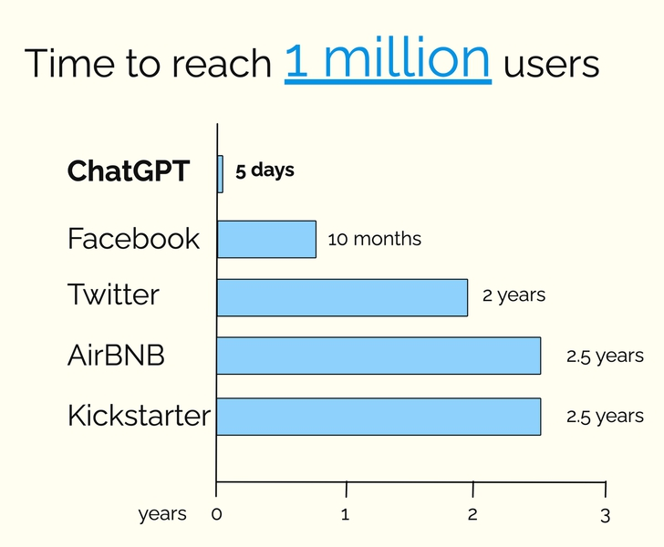
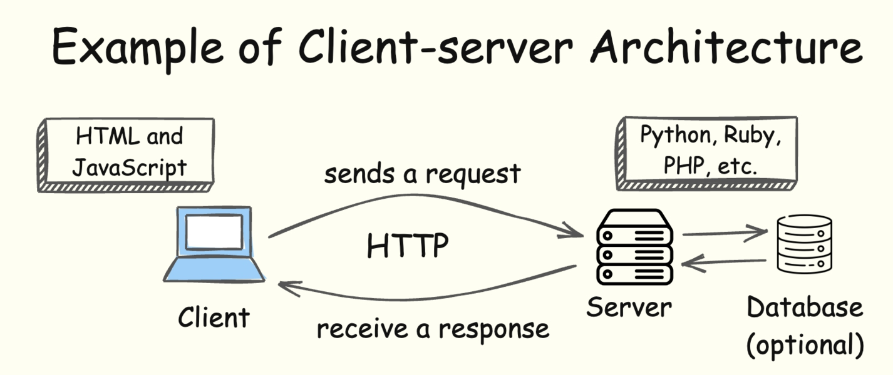
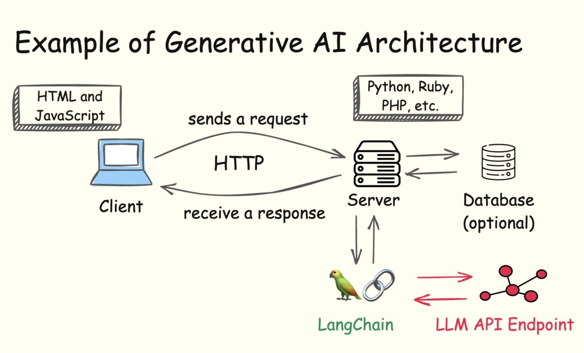
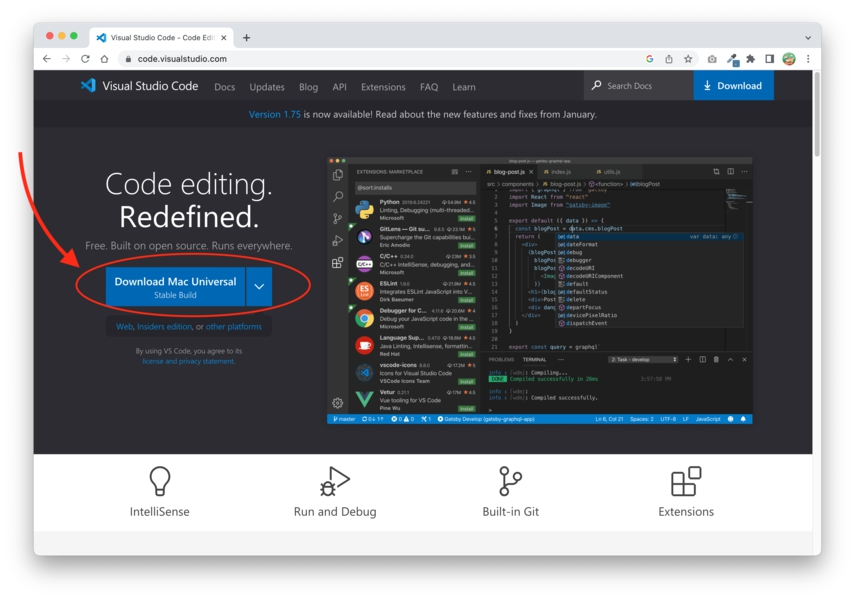

# BAB 1: PENGENALAN APLIKASI GENERATIVE AI

Aplikasi Generative AI adalah aplikasi komputer yang dapat menghasilkan output yang relevan secara kontekstual berdasarkan input (atau prompt) yang diberikan.

Aplikasi Generative AI menjadi perhatian publik umum pada tahun 2022, ketika OpenAI meluncurkan ChatGPT dan dengan cepat mendapatkan 1 juta pengguna hanya dalam 5 hari:

Gambar 2. ChatGPT Mencapai 1 Juta Pengguna dalam 5 Hari

Contoh lain dari aplikasi generative AI adalah chatpdf.com, yang memungkinkan pengguna mengunggah PDF dan melakukan berbagai tugas, seperti mengekstrak wawasan dari PDF.

Jawaban yang disediakan oleh chatpdf.com mengandung referensi ke sumbernya dalam dokumen PDF asli, sehingga tidak perlu lagi membalik halaman untuk mencari sumber.

Di balik layar, aplikasi generative AI ini menggunakan kekuatan Large Language Models (Model Bahasa Besar) untuk menghasilkan jawaban.

Apa itu Large Language Model?

Large Language Model (disingkat LLM) adalah model pembelajaran mesin yang dapat memahami dan menghasilkan keluaran yang dapat dipahami manusia.

LLM biasanya dilatih dengan sejumlah besar data teks yang tersedia di internet sehingga dapat melakukan berbagai tugas terkait bahasa seperti terjemahan, ringkasan, tanya jawab, dan penulisan kreatif.

Contoh LLM termasuk GPT-4 oleh OpenAI, Gemini oleh Google, Llama oleh Meta, dan Mistral oleh Mistral.

Beberapa LLM bersifat tertutup (closed-source), seperti GPT dan Gemini, sementara beberapa bersifat terbuka (open-source) seperti Llama dan Mistral.

Apa itu LangChain?

LangChain adalah framework open-source yang dirancang untuk menyederhanakan proses pengembangan aplikasi yang didukung LLM.

LangChain memungkinkan Anda mengintegrasikan dan memanggil LLM yang menggerakkan aplikasi generative AI hanya dengan memanggil kelas yang merepresentasikan model.

Di balik layar, LangChain akan melakukan langkah-langkah yang diperlukan untuk berinteraksi dengan API model bahasa dan mengelola pemrosesan input dan output sehingga Anda dapat mengakses berbagai LLM dengan perubahan kode minimal.

Selain itu, Anda juga dapat menggunakan sumber data eksternal seperti PDF, artikel Wikipedia, atau hasil mesin pencari dengan LangChain untuk menghasilkan respons yang relevan secara kontekstual.

Dengan menggunakan LangChain, Anda dapat mengembangkan aplikasi generative AI khusus yang dioptimalkan untuk kasus penggunaan tertentu, seperti merangkum video YouTube, mengekstrak wawasan dari PDF, atau menulis esai.

LangChain mendukung Python dan JavaScript. Buku ini berfokus pada versi JavaScript dari LangChain.

## Arsitektur Aplikasi Generative AI

Aplikasi tradisional umumnya menggunakan arsitektur klien-server sebagai berikut:

Gambar 3. Arsitektur Klien-Server

Klien dan server berkomunikasi menggunakan permintaan HTTP. Ketika diperlukan, server dapat berinteraksi dengan basis data untuk memenuhi permintaan yang dikirim oleh klien.

Di sisi lain, aplikasi Generative AI memanfaatkan kekuatan LLM untuk memahami prompt bahasa manusia dan menghasilkan output yang relevan:

Gambar 4. Arsitektur Aplikasi Berbasis AI

Meskipun arsitekturnya mirip dengan aplikasi tradisional, ada lapisan tambahan untuk terhubung ke LLM.

Lapisan tambahan inilah tempat LangChain berperan, karena melakukan dan mengelola tugas-tugas terkait LLM, seperti memproses input kita menjadi prompt yang dapat dipahami LLM. Ia juga memproses respons dari LLM ke dalam format yang diterima di aplikasi tradisional.

Anda akan memahami lebih banyak saat Anda berlatih membangun aplikasi generative AI di bab-bab berikutnya.

Untuk saat ini, anggap LangChain sebagai lapisan manajemen antara server aplikasi Anda dan LLM.

## Persiapan Lingkungan Pengembangan

Untuk mulai mengembangkan aplikasi AI dengan LangChain.js, Anda perlu memiliki tiga hal di komputer Anda:

1. Peramban web
2. Editor kode
3. Program Node.js

Mari kita instal di bagian selanjutnya.

## Menginstal Peramban Chrome

Peramban web apa pun dapat digunakan untuk menjelajahi Internet, tetapi untuk keperluan pengembangan, Anda perlu memiliki peramban dengan alat pengembangan yang memadai.

Peramban Chrome yang dikembangkan oleh Google adalah peramban yang bagus untuk pengembangan web, dan jika Anda belum menginstal peramban tersebut, Anda dapat mengunduhnya di sini:

https://www.google.com/chrome/

Peramban tersedia untuk semua sistem operasi utama. Setelah pengunduhan selesai, ikuti langkah-langkah instalasi yang disajikan oleh installer untuk memiliki peramban di komputer Anda.

Selanjutnya, kita perlu menginstal editor kode. Ada beberapa editor kode gratis yang tersedia di Internet, seperti Sublime Text, Visual Studio Code, dan Notepad++.

Dari editor-editor ini, favorit saya adalah Visual Studio Code karena cepat dan mudah digunakan.

## Menginstal Visual Studio Code

Visual Studio Code atau disingkat VSCode adalah aplikasi editor kode yang dibuat untuk tujuan menulis kode. Selain gratis, VSCode cepat dan tersedia di semua sistem operasi utama.

Anda dapat mengunduh Visual Studio Code di sini:

https://code.visualstudio.com/

Saat Anda membuka tautan di atas, seharusnya ada tombol yang menunjukkan versi yang kompatibel dengan sistem operasi Anda seperti yang ditunjukkan di bawah ini:

Gambar 5. Mengunduh VSCode

Klik tombol untuk mengunduh VSCode, dan instal di komputer Anda.

Sekarang setelah Anda menginstal editor kode, langkah selanjutnya adalah menginstal Node.js.

## Menginstal Node.js

Node.js adalah aplikasi runtime JavaScript yang memungkinkan Anda menjalankan JavaScript di luar peramban. Kita membutuhkan program ini untuk menginstal kompiler TypeScript.

Anda dapat mengunduh dan menginstal Node.js dari https://nodejs.org. Pilih versi LTS yang direkomendasikan karena memiliki dukungan jangka panjang. Proses instalasi cukup mudah.

Untuk memeriksa apakah Node telah terinstal dengan benar, ketik perintah berikut pada baris perintah Anda (Command Prompt di Windows atau Terminal di Mac):

`node -v`

Baris perintah seharusnya merespons dengan nomor versi Node.js yang Anda miliki di komputer.

Node.js juga mencakup program bernama npm (Node Package Manager) yang dapat Anda gunakan untuk menginstal dan mengelola paket Node:

`npm -v`

Paket Node adalah pustaka dan framework JavaScript yang dapat Anda gunakan secara gratis dalam proyek Anda. Kita akan menggunakan npm untuk menginstal beberapa paket nanti.

Sekarang Anda memiliki semua perangkat lunak yang diperlukan untuk mulai mengembangkan aplikasi LangChain. Mari kita lakukan di bab berikutnya.

## Ringkasan

Dalam bab ini, Anda telah mempelajari arsitektur aplikasi generative AI, dan bagaimana LangChain mengambil peran sebagai lapisan integrasi antara server dan endpoint API LLM.

Anda juga telah menginstal alat-alat yang diperlukan untuk menulis dan menjalankan aplikasi LangChain di komputer Anda.

Jika Anda mengalami masalah, Anda dapat mengirim email kepada saya di nathan@codewithnathan.com dan saya akan berusaha sebaik mungkin untuk membantu Anda.
