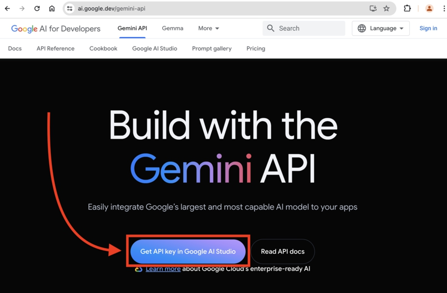
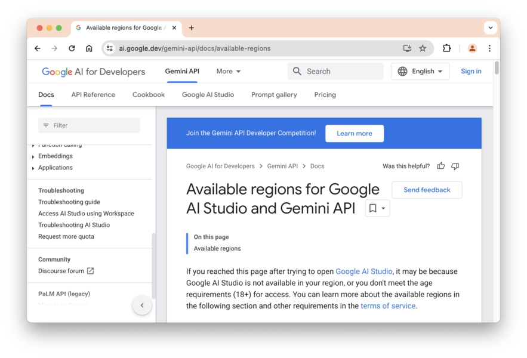
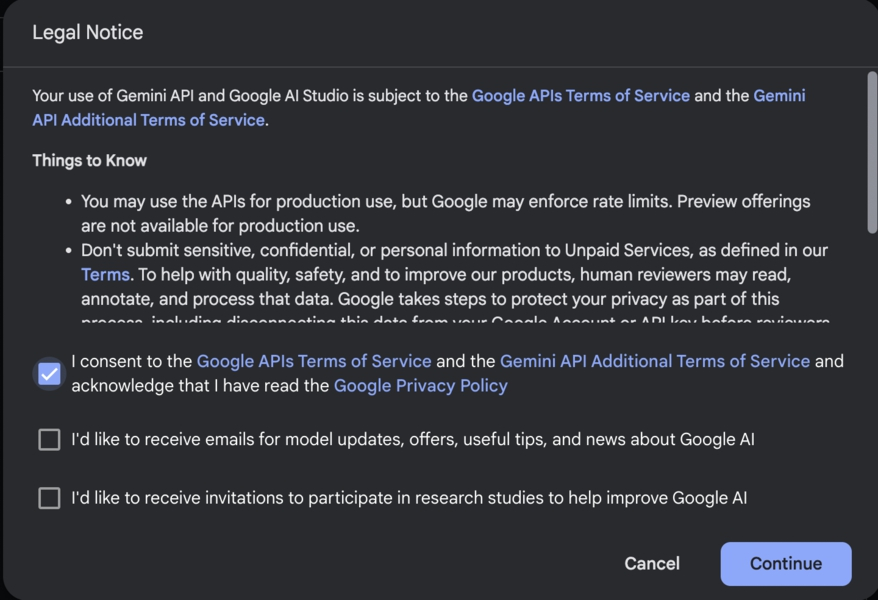
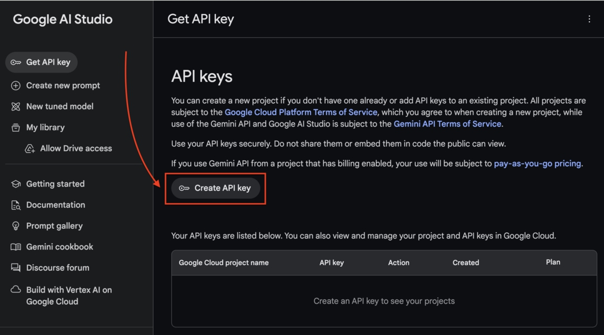
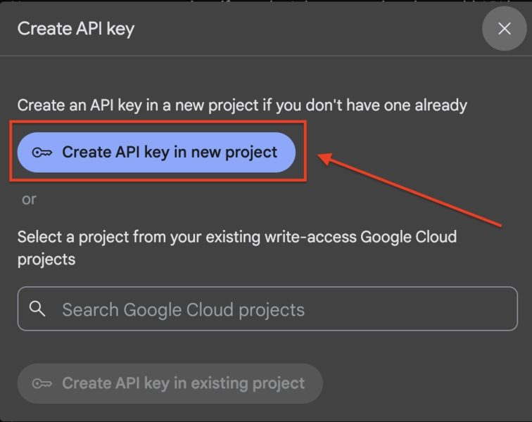
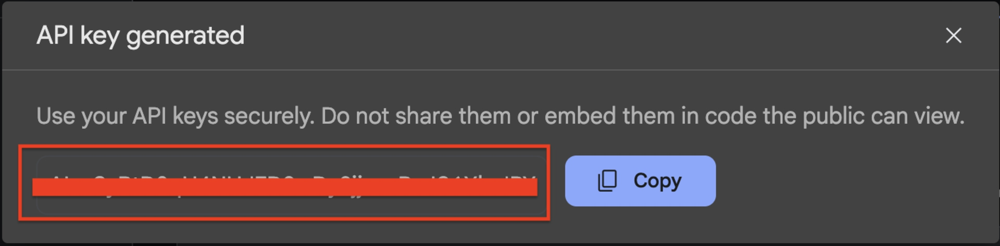

# BAB 2: APLIKASI LANGCHAIN PERTAMA ANDA

## Saatnya membuat aplikasi LangChain pertama kita.

Kita akan membuat aplikasi tanya jawab sederhana di mana kita dapat menanyakan berbagai jenis pertanyaan ke Large Language Model.

Pertama, buat folder di komputer Anda yang akan digunakan untuk menyimpan semua file terkait proyek ini. Anda bisa menamai folder tersebut 'beginning_langchain_js'.

Selanjutnya, buka Visual Studio Code, dan pilih File > Buka Folder… dari menu bar. Pilih folder yang baru saja Anda buat.

VSCode akan memuat folder dan menampilkan isinya di sidebar Explorer, seharusnya kosong karena kita belum membuat file apa pun.

Untuk membuat file, klik kanan di mana saja di dalam jendela VSCode dan pilih New Text File atau New File… dari menu.

Setelah file dibuat, tekan Control + S atau Command + S untuk menyimpan file. Beri nama file tersebut sebagai app.js.

## Memasang Paket LangChain

Sekarang Anda perlu memasang paket-paket yang diperlukan untuk membuat aplikasi LangChain.

Di VSCode, klik kanan pada folder yang baru saja Anda buat, lalu pilih Open in Integrated Terminal untuk menampilkan command line di dalam VSCode.

Di terminal, jalankan perintah berikut:

`npm install langchain @langchain/google-genai dotenv`

Perintah di atas akan memasang tiga paket:

• `langchain` berisi semua modul inti LangChain

• `@langchain/google-genai` adalah modul integrasi Google Generative AI

• `dotenv` digunakan untuk memuat kunci API LLM dari variabel lingkungan

Setelah paket-paket terpasang, npm akan menghasilkan file package.json yang berisi versi dari paket-paket yang terpasang.

## Membuat Aplikasi Tanya & Jawab

Saatnya menulis kode untuk aplikasi tanya jawab.

Pada file app.js, impor kelas Google Generative AI dan muat variabel lingkungan:

```JavaScript
import { ChatGoogleGenerativeAI } from '@langchain/google-genai';

// muat variabel lingkungan
import 'dotenv/config';
```

Untuk berinteraksi dengan LLM di LangChain, Anda perlu membuat objek yang merepresentasikan API untuk LLM tersebut.

Karena kita ingin berinteraksi dengan LLM milik Google, kita perlu membuat objek dari kelas ChatGoogleGenerativeAI sebagai berikut:

```JavaScript

const llm = new ChatGoogleGenerativeAI({
    model: 'gemini-2.5-flash',
    apiKey: process.env.GOOGLE_GEMINI_KEY,
});
```

`GOOGLE_GEMINI_KEY` berisi kunci API yang akan Anda dapatkan di bagian selanjutnya.

Untuk saat ini, Anda hanya perlu memahami bahwa objek ChatGoogleGenerativeAI merepresentasikan LLM Google yang ingin Anda gunakan.

Saat membuat instance objek llm baru, Anda perlu meneruskan objek yang menentukan opsi untuk instance tersebut.

Opsi model diperlukan agar Google tahu model mana yang ingin Anda gunakan, dan opsi apiKey digunakan untuk memverifikasi bahwa Anda memiliki izin untuk menggunakan model tersebut.

Selanjutnya, tulis kode untuk aplikasi tanya jawab sederhana sebagai berikut:

```JavaScript

console.log('Q & A Dengan AI');
console.log('=============');

const question = "Apa mata uang Thailand?";
console.log(`Pertanyaan: ${question}`);

const response = await llm.invoke(question);
console.log(`Jawaban: ${response.content}`);
```

Dalam kode di atas, kita cukup mencetak beberapa teks yang menunjukkan pertanyaan yang ingin kita ajukan ke model.

Metode `llm.invoke()` akan mengirim pertanyaan input ke LLM dan mengembalikan objek respons.

Jawaban disimpan di bawah properti content, jadi kita mencetak nilai `response.content`.

Karena kita menggunakan sintaks await, kita perlu menambahkan opsi `"type": "module"` di file package.json sebagai berikut:

```JavaScript

{
    "type": "module",
    "dependencies": {
    // ...
    }
}
```

Opsi type ini juga diperlukan ketika kita menggunakan sintaks `import` untuk paket-paket alih-alih `require()`.

Sekarang aplikasi sudah siap, tetapi kita masih perlu mendapatkan kunci API Google Gemini untuk mengakses LLM.

## Mendapatkan Kunci API Google Gemini

Untuk mendapatkan kunci API, Anda perlu mengunjungi halaman Gemini API di https://ai.google.dev/gemini-api

Di halaman tersebut, Anda perlu mengeklik tombol 'Get API Key in Google AI Studio' seperti yang ditunjukkan di bawah ini:

Gambar 6. Dapatkan Kunci API Gemini


Dari sana, Anda akan dibawa ke Google AI Studio.

Perhatikan bahwa, Anda mungkin akan melihat halaman di bawah ini ketika mengeklik tombol:

Gambar 7. Halaman Wilayah Tersedia Google AI Studio



Halaman ini biasanya muncul ketika Anda berada di wilayah yang tidak dilayani oleh Google AI Studio.

Salah satu cara untuk menanganinya adalah dengan menggunakan layanan VPN, tetapi saya merekomendasikan Anda menggunakan LLM lain sebagai gantinya, seperti OpenAI atau Ollama yang akan saya tunjukkan di bab-bab berikutnya.

Jika ini adalah pertama kalinya Anda mengakses studio, itu akan menunjukkan ketentuan layanan seperti ini:

Gambar 8. Ketentuan Layanan Google AI Studio



Cukup centang opsi 'I consent', lalu klik 'Continue'.

Sekarang klik tombol 'Create API Key' untuk membuat kunci:

Gambar 9. Buat Kunci API Gemini



Jika Anda ditanya di mana membuat Kunci API, pilih create in new project:

Gambar 10. Buat Kunci API di Proyek Baru



Google akan membuat proyek Cloud dan menghasilkan kunci untuk Anda.

Setelah beberapa saat, Anda akan melihat kunci ditampilkan dalam kotak pop-up sebagai berikut:

Gambar 11. Kunci API Gemini Dihasilkan



Salin string kunci API, lalu buat file .env di folder aplikasi Anda dengan konten berikut:

`GOOGLE_GEMINI_KEY='Kunci Anda Di Sini'
`

Ganti string Kunci Anda Di Sini di atas dengan kunci API aktual Anda.

## Menjalankan Aplikasi

Dengan kunci API yang didapatkan, Anda siap menjalankan aplikasi LangChain.

Dari terminal, jalankan file `app.js` menggunakan `Node.js` sebagai berikut:

`node app.js`

Anda akan melihat output berikut di terminal Anda:

## Q & A Dengan AI

```
Pertanyaan: Apa mata uang Thailand?
Jawaban: Baht Thailand
```

Ini berarti Anda telah berhasil membuat aplikasi LangChain pertama Anda dan berinteraksi dengan LLM Gemini Google menggunakan kunci API.

Setiap model LLM memiliki karakteristiknya sendiri. Model 'gemini-2.5-flash' biasanya menjawab pertanyaan secara langsung tanpa informasi tambahan.

Anda dapat mencoba mengganti model menjadi 'gemini-1.5-flash-latest' seperti yang ditunjukkan di bawah ini:

```JavaScript

const llm = new ChatGoogleGenerativeAI({
    model: 'gemini-1.5-flash-latest',
    apiKey: process.env.GOOGLE_GEMINI_KEY,
});
```

Sekarang jalankan lagi file app.js, dan jawabannya sedikit berbeda kali ini:

## Q & A Dengan AI

```
Pertanyaan: Apa mata uang Thailand?
Jawaban: Mata uang Thailand adalah **Baht Thailand**, yang disingkat menjadi **THB**.
```

Di sini, `'gemini-1.5-flash'` mengulangi pertanyaan terlebih dahulu, kemudian memberikan informasi lebih lanjut seperti singkatan mata uang dan simbol.

Simbol asterisk \*\* di sekitar THB dimaksudkan untuk membuat teks muncul tebal, tetapi dirender apa adanya di terminal.

Sekarang coba ganti variabel pertanyaan dengan pertanyaan apa pun yang ingin Anda tanyakan ke LLM.

## Error Resource Exhausted

Saat menggunakan Google Gemini, Anda mungkin melihat error seperti ini ketika menjalankan aplikasi:

`ResourceExhausted: 429 Resource` telah habis (misalnya, periksa kuota)..

Error ini terjadi karena sumber daya tier gratis telah habis. Anda perlu mencoba lagi di lain waktu.

## Ringkasan

Kode untuk bab ini tersedia di folder `02_Simple_Q&A_Gemini`.

Di bab ini, Anda telah membuat dan menjalankan aplikasi LangChain pertama Anda. Selamat!

Aplikasi dapat terhubung ke LLM Gemini Google untuk mengajukan pertanyaan dan mendapatkan jawaban.

Di bab berikutnya, kita akan mempelajari cara menggunakan model GPT OpenAI di LangChain.
