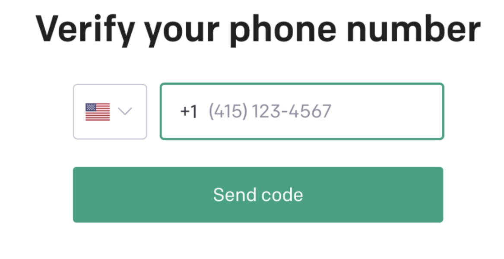
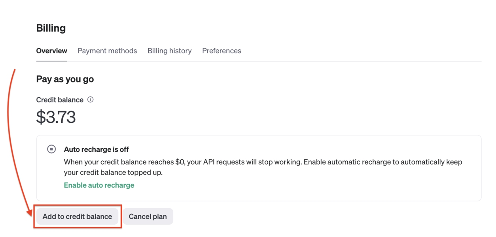
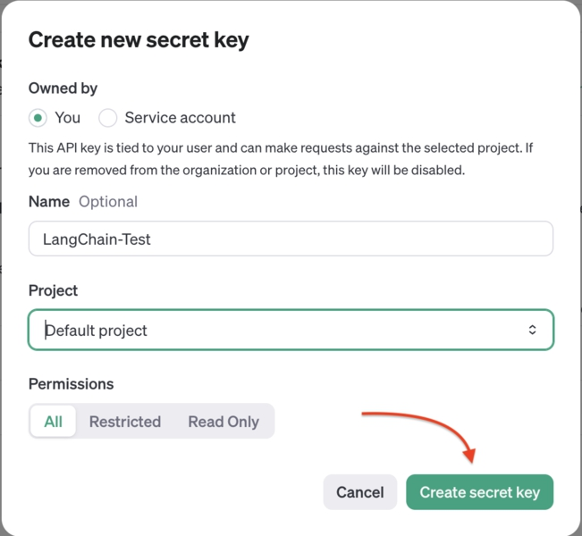
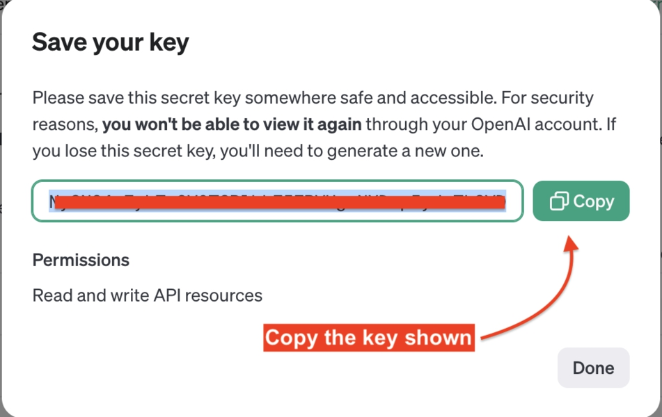

# BAB 3: MENGGUNAKAN OPENAI LLM DI LANGCHAIN

Di bab sebelumnya, Anda telah melihat cara berkomunikasi dengan model Gemini milik Google menggunakan LangChain.

Di bab ini, saya akan menunjukkan cara menggunakan OpenAI di LangChain sebagai alternatif.

Namun perlu diingat bahwa API OpenAI tidak memiliki tier gratis. Dulu mereka memberikan kredit API senilai $5, tetapi sepertinya sudah diam-diam dihentikan.

Jadi jika Anda ingin menggunakan API OpenAI, Anda perlu membeli kredit minimal, yaitu $5 USD.

## Memulai Dengan API OpenAI

OpenAI adalah perusahaan penelitian AI yang bertujuan mengembangkan dan mempromosikan perangkat lunak AI yang cakap untuk kemanusiaan. ChatGPT yang terkenal adalah salah satu produk yang dikembangkan oleh OpenAI.

Selain aplikasi ChatGPT, OpenAI juga menawarkan model GPT, LLM yang menggerakkan ChatGPT, dalam bentuk endpoint API HTTP.

Untuk menggunakan API OpenAI, Anda perlu mendaftar akun di situs web mereka di https://platform.openai.com.

Setelah mendaftar, Anda dapat pergi ke https://platform.openai.com/api-keys untuk membuat kunci rahasia baru.

Saat Anda mencoba membuat kunci untuk pertama kali, Anda akan diminta verifikasi dengan menambahkan nomor telepon:

Gambar 12. Verifikasi Telepon OpenAI

OpenAI hanya menggunakan nomor telepon Anda untuk keperluan verifikasi. Anda akan menerima kode verifikasi melalui SMS.

Setelah terverifikasi, Anda akan diminta untuk menambahkan saldo kredit untuk penggunaan API. Jika tidak, buka https://platform.openai.com/account/billing untuk menambahkan beberapa kredit.



Gambar 13. OpenAI Menambahkan Kredit

OpenAI menerima pembayaran menggunakan kartu kredit, jadi Anda perlu memilikinya. Jumlah terendah yang dapat Anda beli adalah $5 USD, dan itu sudah lebih dari cukup untuk menjalankan semua contoh di buku ini menggunakan OpenAI.

Alternatifnya, jika Anda mendapatkan kredit uji coba gratis $5, maka Anda tidak perlu mengatur informasi penagihan.

Selanjutnya, masukkan nama dan pilih proyek yang akan dimiliki kunci:



Gambar 14. OpenAI Membuat Kunci API

Klik tombol 'Create secret key', dan OpenAI akan menunjukkan kunci yang dihasilkan:



Gambar 15. OpenAI Menyalin Kunci API

Anda perlu menyalin dan menempelkan kunci API ini ke file .env proyek Anda:

`OPENAI_KEY='Kunci Anda Di Sini'`

Sekarang setelah kunci OpenAI siap, saatnya menggunakannya di aplikasi LangChain.

## Mengintegrasikan OpenAI Dengan LangChain

Untuk menggunakan OpenAI di LangChain, Anda perlu menginstal paket `@langchain/openai` menggunakan npm:

`npm install @langchain/openai`

Setelah paket terinstal, buat file baru bernama app_gpt.js dan impor kelas ChatOpenAI dari paket tersebut.



Saat menginstansiasi objek llm, tentukan opsi model dan openAIApiKey seperti yang ditunjukkan di bawah ini:

```JavaScript
import { ChatOpenAI } from '@langchain/openai';

import 'dotenv/config';

const llm = new ChatOpenAI({
    model: 'gpt-4o',
    openAIApiKey: process.env.OPENAI_KEY,
});
```

Anda dapat mengubah parameter model dengan model yang ingin Anda gunakan. Pada saat penulisan ini, GPT-4o adalah LLM terbaru yang dirilis oleh OpenAI.

Mari tanyakan GPT pertanyaan yang sama yang kita tanyakan ke Gemini:

```JavaScript

console.log('Tanya Jawab Dengan AI');
console.log('=====================');

const question = "Apa mata uang Thailand?";
console.log(`Pertanyaan: ${question}`);

const response = await llm.invoke(question);
console.log(`Jawaban: ${response.content}`);
```

Simpan perubahan, lalu jalankan file menggunakan Node.js:

`node app_gpt.js`
Anda seharusnya mendapatkan respons serupa dengan ini:

## Tanya Jawab Dengan AI

```
Pertanyaan: Apa mata uang Thailand?
Jawaban: Mata uang Thailand adalah Baht Thailand. Kode ISO-nya adalah THB.
```

Ini berarti aplikasi LangChain berhasil berkomunikasi dengan model chat GPT dari OpenAI. Keren!

Anda dapat mencoba menanyakan pertanyaan lain dengan mengubah nilai variabel pertanyaan.

## ChatGPT vs Gemini: Mana yang Harus Digunakan?

Baik ChatGPT maupun Gemini sangat mampu melakukan tugas yang kita ingin mereka lakukan dalam buku ini, jadi itu benar-benar terserah Anda.

Dulu, OpenAI biasa memberikan kredit $5 gratis. Namun sepertinya itu tidak lagi terjadi, karena banyak orang di forum OpenAI mengatakan mereka tidak mendapatkannya setelah mendaftar.

Di sisi lain, Google menawarkan tier gratis untuk model Gemini sebagai imbalan menggunakan data kami untuk melatih model, jadi tidak masalah menggunakannya untuk belajar dan menjelajahi LangChain.

Namun, Google berhak menghentikan tier gratis kapan saja, jadi izinkan saya memperkenalkan satu cara lagi untuk menggunakan LLM di LangChain.

Kali ini, kita akan menggunakan model open-source.

## Ringkasan

Kode untuk bab ini tersedia di folder 03_Using_OpenAI dari kode sumber buku.

Di bab ini, Anda telah belajar cara membuat kunci API OpenAI dan menggunakannya dalam aplikasi LangChain.

Di sini, kita mulai melihat salah satu manfaat menggunakan LangChain, yaitu integrasi mudah dengan LLM jenis apa pun.

LangChain merepresentasikan LLM sebagai paket yang dapat Anda instal dan impor ke proyek Anda.

Anda hanya perlu membuat instance dari kelas model dan menjalankan metode invoke() untuk mengakses LLM.

Kapan pun Anda perlu menggunakan LLM lain, Anda hanya perlu mengubah kelas yang digunakan dan memberikan model serta kunci API yang tepat.
