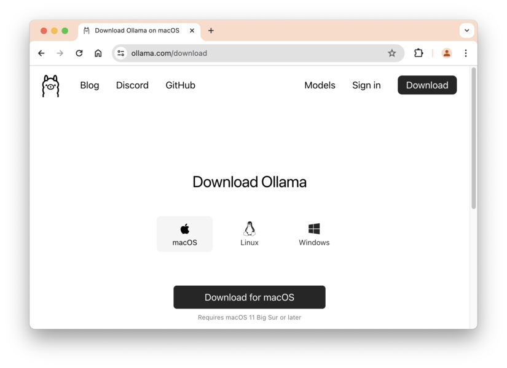
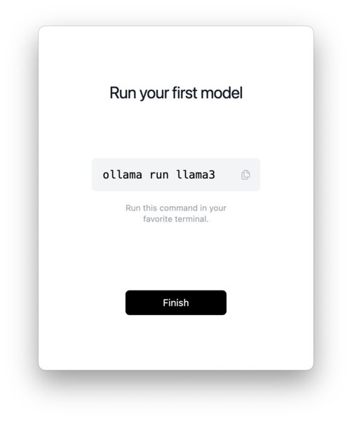
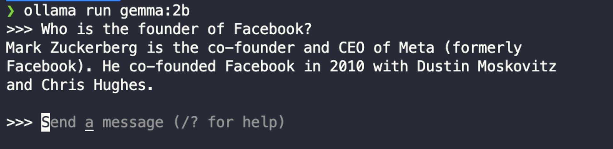
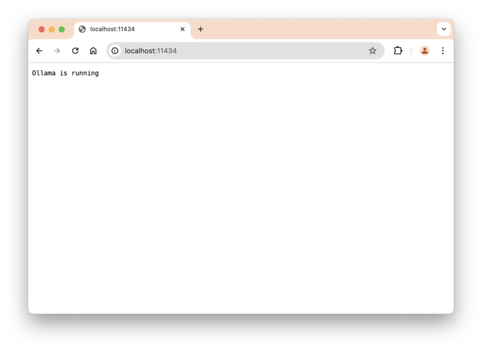

# BAB 4: MENGGUNAKAN LLMS OPEN-SOURCE DI LANGCHAIN

Pustaka LangChain memungkinkan Anda berkomunikasi dengan LLMs jenis apa pun, dari LLMs proprietary seperti Google Gemini dan OpenAI GPT hingga LLMs open-source seperti Meta Llama dan Mistral.

Bab ini akan menunjukkan cara menggunakan model open-source di LangChain. Mari kita mulai.

## Pengenalan Ollama

Ollama adalah alat yang digunakan untuk menjalankan LLMs secara lokal. Ollama menangani pengunduhan, pengelolaan, dan membuka endpoint API HTTP untuk model yang ingin Anda gunakan di komputer Anda.

Untuk memulai, kunjungi https://ollama.com dan klik tombol 'Download'.

Dari sana, Anda dapat memilih versi untuk Sistem Operasi Anda:

Gambar 16. Mengunduh Ollama



Setelah diunduh, buka paketnya dan ikuti instruksi sampai Anda diminta untuk menginstal alat command line sebagai berikut:

Gambar 17. Menginstal Perintah Terminal Ollama


Silakan klik tombol 'Install'.

Setelah instalasi selesai, Ollama akan menunjukkan cara menjalankan model:

Gambar 18. Ollama Menjalankan Model Pertama Anda



Tapi karena Llama 3 adalah model dengan 8 miliar parameter, ukuran model cukup besar yaitu 4,7 GB.

Saya menyarankan Anda menjalankan model Gemma sebagai gantinya, yang memiliki 2 miliar parameter:

```bash
ollama run gemma:2b
```

Model Gemma adalah model ringan dari Google, jadi Anda dapat menganggapnya sebagai versi open-source dari Google Gemini.

Model Gemma 2B hanya berukuran 1,7 GB, sehingga sangat berguna ketika Anda ingin mencoba ollama.

Setelah pengunduhan selesai, Anda dapat langsung menggunakan model dari terminal. Ajukan pertanyaan seperti yang ditunjukkan di bawah ini:

Gambar 19. Contoh Menanyakan Gemma di Ollama



Untuk keluar dari model yang sedang berjalan, ketik /bye dan tekan Enter.

Selama Ollama berjalan di komputer Anda, endpoint API Ollama dapat diakses di localhost:11434 seperti yang ditunjukkan di bawah ini:

Gambar 20. Endpoint API Lokal Ollama



LangChain akan menggunakan endpoint API ini untuk berkomunikasi dengan model Ollama, yang akan kita lakukan selanjutnya.

## Menggunakan Ollama di LangChain

Untuk menggunakan model yang diunduh oleh Ollama, Anda perlu mengimpor kelas ChatOllama yang dikembangkan oleh komunitas LangChain.

Dari terminal, instal paket komunitas menggunakan npm sebagai berikut:

```
npm install @langchain/community
```

Selanjutnya, buat file baru bernama app_ollama.py dan impor model chat Ollama seperti yang ditunjukkan di bawah ini:

```javascript
import { ChatOllama } from "@langchain/community/chat_models/ollama"

const llm = new ChatOllama({
  model: "gemma:2b",
})

console.log("Q & A With AI")
console.log("=============")

const question = "What's the currency of Thailand?"
console.log(`Question: ${question}`)

const response = await llm.invoke(question)
console.log(`Answer: ${response.content}`)
```

Karena Ollama bersifat open-source dan lokal, Anda tidak perlu mengimpor modul dotenv dan menggunakan kunci API.

Sekarang Anda dapat menjalankan file menggunakan Node.js untuk berkomunikasi dengan LLM. Anda akan mendapatkan respons serupa dengan ini:

## Tanya Jawab Dengan AI

```
Question: What's the currency of Thailand?
Answer: The currency of Thailand is the Thai baht (THB). It is subdivided into 100 sen. The baht is denoted by the symbol THB.
```

Perhatikan bahwa karena model LLM berjalan di komputer Anda, jawaban mungkin membutuhkan waktu lebih lama dibandingkan dengan model Gemini dan GPT.

Dan itulah cara menggunakan Ollama di LangChain. Jika Anda ingin menggunakan model open-source lainnya, Anda perlu mengunduh model dengan Ollama terlebih dahulu:

```
ollama pull mistral
```

Perintah pull mengunduh model tanpa menjalankannya di command line.

Setelah itu, Anda dapat mengganti parameter model saat membuat objek ChatOllama:

```javascript
// Ganti model
const llm = new ChatOllama({
  model: "mistral",
})
```

Ingat bahwa semakin besar model, semakin lama waktu yang dibutuhkan untuk menjalankannya.

Panduan umumnya adalah Anda harus memiliki setidaknya 8 GB RAM yang tersedia untuk menjalankan model 7B, 16 GB untuk menjalankan model 13B, dan 32 GB untuk menjalankan model 33B.

Ada banyak model open-source yang dapat Anda jalankan menggunakan Ollama, seperti Google Gemma dan Microsoft Phi-3.

Anda dapat menjelajahi https://ollama.com/library untuk melihat semua model yang tersedia.

## Sekali Lagi, Mana yang Harus Digunakan?

Sejauh ini, Anda telah mempelajari cara menggunakan Google Gemini, OpenAI GPT, dan model open-source Ollama. Mana yang harus digunakan dalam aplikasi Anda?

Saya merekomendasikan Anda menggunakan OpenAI GPT jika Anda mampu karena API-nya tidak dibatasi kuota dan hasilnya bagus.

Jika Anda tidak dapat menggunakan OpenAI GPT karena alasan apa pun, maka Anda dapat menggunakan Google Gemini tier gratis jika tersedia di negara Anda.

Jika tidak, Anda dapat menggunakan Ollama dan mengunduh model Gemma 2B atau Llama 3, berdasarkan kapasitas RAM komputer Anda.

Kecuali disebutkan khusus, saya akan menggunakan OpenAI GPT untuk semua contoh kode yang ditunjukkan dalam buku ini.

Tapi jangan khawatir karena mengganti bagian LLM di LangChain sangat mudah. Anda hanya perlu mengubah variabel llm itu sendiri seperti yang ditunjukkan di bab ini.

Anda dapat mendapatkan contoh kode yang menggunakan Gemini dan Ollama di repositori.

## Ringkasan

Kode untuk bab ini tersedia di folder `04_Using_Ollama` dari kode sumber buku.

Di bab ini, Anda telah mempelajari cara menggunakan LLMs open-source menggunakan Ollama dan LangChain.

Dengan menggunakan Ollama, Anda dapat mengunduh dan menjalankan Large Language Models apa pun yang open-source dan gratis digunakan.

Jika Anda melihat situs web Ollama, Anda akan menemukan banyak model yang sangat mumpuni dan bahkan dapat menyaingi kinerja model proprietary seperti Gemini dan ChatGPT.

Jika Anda khawatir tentang privasi data Anda dan ingin memastikan bahwa tidak ada yang menggunakannya untuk melatih LLM mereka, maka menggunakan LLMs open-source seperti Llama 3, Mistral, atau Gemma bisa menjadi pilihan yang bagus.
