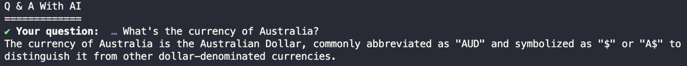
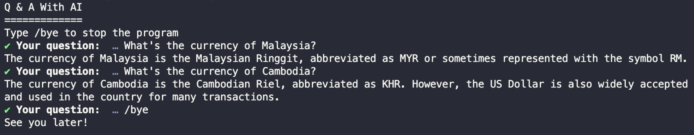

# BAB 5: SEDIAKAN INPUT PENGGUNA DENGAN PROMPT

Sejauh ini, Anda telah menanyakan LLM dengan menulis pertanyaan dalam konstanta `question`.

Alih-alih harus mengetik pertanyaan secara eksplisit, mari kita aktifkan input pengguna agar Anda dapat mengetik pertanyaan di terminal.

Ini dapat dilakukan dengan menginstal paket `prompts` dari npm:

```
npm install prompts
```

Paket `prompts` adalah paket ringan yang digunakan untuk menambah interaktivitas pada terminal.

Artinya Anda dapat meminta input pengguna saat menjalankan aplikasi tanya jawab.

Kembali ke aplikasi, impor paket `prompts` dan minta sebuah pertanyaan seperti ini:

```javascript
import prompts from "prompts"

console.log("Q & A Dengan AI")
console.log("=============")

const { question } = await prompts({
  type: "text",
  name: "question",
  message: "Pertanyaan Anda: ",
  validate: (value) => (value ? true : "Pertanyaan tidak boleh kosong"),
})

const response = await llm.invoke(question)
console.log(response.content)
```

Fungsi `prompts()` menerima objek atau array objek, lalu menggunakan setiap objek untuk membentuk pertanyaan kepada pengguna.

Anda dapat menentukan tipe respons, nama variabel untuk menyimpan input pengguna, pesan yang ditampilkan saat meminta input, kemudian fungsi validasi.

Fungsi `prompts()` akan terus menanyakan pertanyaan yang sama hingga fungsi validasi mengembalikan `true`.

Jika Anda menjalankan aplikasi sekarang, Anda dapat mengetik pertanyaan di terminal seperti yang ditunjukkan di bawah:

Gambar 21. Input Pengguna Di Terminal



Dengan ini, Anda dapat menanyakan berbagai jenis pertanyaan tanpa perlu mengganti variabel `question` setiap kali.

Anda juga dapat mengizinkan pengguna untuk mengobrol dengan LLM hingga pengguna mengetik `/bye` di terminal.

Bungkus prompt input pengguna dalam loop while seperti di bawah ini:

```javascript
console.log("Q & A With AI")
console.log("=============")
console.log("Ketik /bye untuk menghentikan program")

let exit = false
while (!exit) {
  const { question } = await prompts({
    type: "text",
    name: "question",
    message: "Pertanyaan Anda: ",
    validate: (value) => (value ? true : "Pertanyaan tidak boleh kosong"),
  })
  if (question == "/bye") {
    console.log("Sampai jumpa!")
    exit = true
  } else {
    const response = await llm.invoke(question)
    console.log(response.content)
  }
}
```

Dengan cara ini, JavaScript akan terus meminta input hingga pengguna mengetik `/bye`:



Kami akan meminta lebih banyak input di bab-bab mendatang, sehingga memiliki modul `prompts` akan sangat berguna.

## Ringkasan

Kode untuk bab ini tersedia di folder `05_Enabling_User_Input` dari kode sumber buku.

Dalam bab ini, Anda telah menambahkan paket `prompts` untuk menangkap input pengguna dan membuat aplikasi lebih interaktif.

Paket `prompts` hanya akan digunakan selama kita mempelajari LangChain. Tidak akan digunakan ketika kita mengembangkan aplikasi web nanti.

Di bab selanjutnya, kita akan belajar tentang template prompt.
