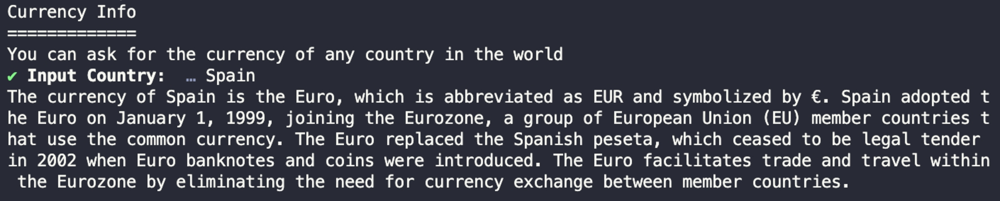
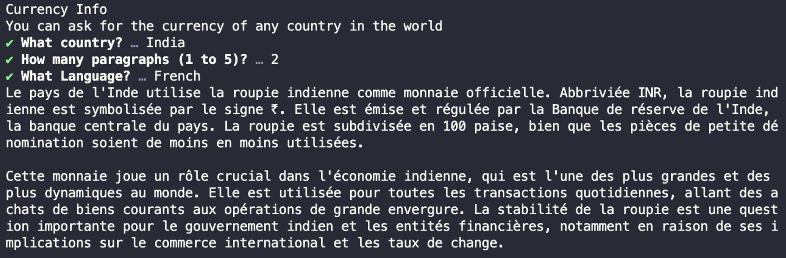
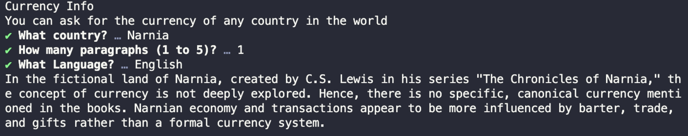
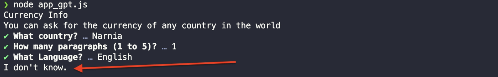

# BAB 5: MENGENABKAN INPUT PENGGUNA DENGAN PROMPT

Sejauh ini, Anda telah menanyakan LLM dengan menulis pertanyaan dalam konstanta `question`.

Alih-alih harus mengetik pertanyaan secara eksplisit, mari kita aktifkan input pengguna agar Anda dapat mengetik pertanyaan di terminal.

Ini dapat dilakukan dengan menginstal paket `prompts` dari npm:

```
npm install prompts
```

Paket `prompts` adalah paket ringan yang digunakan untuk menambah interaktivitas pada terminal.

Artinya Anda dapat meminta input pengguna saat menjalankan aplikasi tanya jawab.

Kembali ke aplikasi, impor paket `prompts` dan minta sebuah pertanyaan seperti ini:

```javascript
import prompts from "prompts"

console.log("Q & A Dengan AI")
console.log("=============")

const { question } = await prompts({
  type: "text",
  name: "question",
  message: "Pertanyaan Anda: ",
  validate: (value) => (value ? true : "Pertanyaan tidak boleh kosong"),
})

const response = await llm.invoke(question)
console.log(response.content)
```

Fungsi `prompts()` menerima objek atau array objek, lalu menggunakan setiap objek untuk membentuk pertanyaan kepada pengguna.

Anda dapat menentukan tipe respons, nama variabel untuk menyimpan input pengguna, pesan yang ditampilkan saat meminta input, kemudian fungsi validasi.

Fungsi `prompts()` akan terus menanyakan pertanyaan yang sama hingga fungsi validasi mengembalikan `true`.

Jika Anda menjalankan aplikasi sekarang, Anda dapat mengetik pertanyaan di terminal seperti yang ditunjukkan di bawah:

Gambar 21. Input Pengguna Di Terminal

Dengan ini, Anda dapat menanyakan berbagai jenis pertanyaan tanpa perlu mengganti variabel `question` setiap kali.

Anda juga dapat mengizinkan pengguna untuk mengobrol dengan LLM hingga pengguna mengetik `/bye` di terminal.


Bungkus prompt input pengguna dalam loop while seperti di bawah ini:

```javascript
console.log("Q & A With AI")
console.log("=============")
console.log("Ketik /bye untuk menghentikan program")

let exit = false
while (!exit) {
  const { question } = await prompts({
    type: "text",
    name: "question",
    message: "Pertanyaan Anda: ",
    validate: (value) => (value ? true : "Pertanyaan tidak boleh kosong"),
  })
  if (question == "/bye") {
    console.log("Sampai jumpa!")
    exit = true
  } else {
    const response = await llm.invoke(question)
    console.log(response.content)
  }
}
```

Dengan cara ini, JavaScript akan terus meminta input hingga pengguna mengetik `/bye`:

Kami akan meminta lebih banyak input di bab-bab mendatang, sehingga memiliki modul `prompts` akan sangat berguna.

## Ringkasan

Kode untuk bab ini tersedia di folder `05_Enabling_User_Input` dari kode sumber buku.


Dalam bab ini, Anda telah menambahkan paket `prompts` untuk menangkap input pengguna dan membuat aplikasi lebih interaktif.

Paket `prompts` hanya akan digunakan selama kita mempelajari LangChain. Tidak akan digunakan ketika kita mengembangkan aplikasi web nanti.

Di bab selanjutnya, kita akan belajar tentang template prompt.

BAB 6: TEMPLATE PROMPT LANGCHAIN

Template prompt LangChain adalah kelas JavaScript yang digunakan untuk membuat prompt (atau instruksi) spesifik untuk dikirim ke Large Language Model.

Dengan menggunakan template prompt, kita dapat mereproduksi instruksi yang sama sementara hanya memerlukan input minimal dari pengguna.

Untuk menunjukkan contoh, misalkan Anda membuat aplikasi AI sederhana yang hanya memberikan informasi mata uang dari negara tertentu.

Berdasarkan yang sudah kita ketahui, satu-satunya cara untuk melakukan ini adalah terus mengulang pertanyaan sambil mengubah negara seperti yang ditunjukkan di bawah:

Pertanyaan Anda: ... Apa mata uang Malaysia?
...
Pertanyaan Anda: ... Apa mata uang India?
...
Pertanyaan Anda: ... Apa mata uang Kamboja?

Alih-alih mengulang pertanyaan, Anda dapat membuat template untuk pertanyaan tersebut sebagai berikut:

```javascript
console.log("Info Mata Uang")
console.log("=============")
console.log("Anda dapat menanyakan mata uang negara mana pun di dunia")

const { country } = await prompts({
  type: "text",
  name: "country",
  message: "Masukkan Negara: ",
  validate: (value) => (value ? true : "Negara tidak boleh kosong"),
})

const response = await llm.invoke(`Apa mata uang ${country}`)
console.log(response.content)
```

Sekarang Anda hanya perlu memberikan nama negara untuk mendapatkan informasi mata uang.

Meskipun Anda dapat menggunakan template string seperti di atas, LangChain merekomendasikan Anda menggunakan kelas template prompt untuk penggunaan ulang yang efektif. Mari saya tunjukkan caranya.

Membuat Template Prompt

Untuk membuat template prompt, Anda perlu mengimpor kelas `PromptTemplate` dari `@langchain/core/prompts` seperti di bawah:

```javascript
import { PromptTemplate } from "@langchain/core/prompts"
```

Langkah selanjutnya adalah membuat prompt itu sendiri.

Anda dapat membuat variabel bernama `prompt`, lalu meneruskan panggilan ke konstruktor `PromptTemplate()` ke variabel tersebut:

```javascript
const prompt = new PromptTemplate({})
```

Saat memanggil konstruktor `PromptTemplate()`, Anda perlu memberikan dua argumen:

1. `inputVariables` - Array dari nama-nama variabel yang digunakan dalam template
2. `template` - String untuk template prompt itu sendiri

Berikut contoh panggilan `PromptTemplate()` yang lengkap:

```javascript
const prompt = new PromptTemplate({
  inputVariables: ["country"],
  template: `Apa mata uang {country}? Jawab dalam satu paragraf pendek`,
})
```

Sekarang Anda dapat menggunakan objek `prompt` saat memanggil metode `llm.invoke()`.

Anda perlu memanggil metode `prompt.format()` dan meneruskan variabel yang ditentukan dalam parameter `inputVariables` seperti di bawah:

```javascript
const { country } = await prompts({
  type: "text",
  name: "country",
  message: "Masukkan Negara: ",
  validate: (value) => (value ? true : "Negara tidak boleh kosong"),
})

const response = await llm.invoke(await prompt.format({ country: country }))
console.log(response.content)
```

Sekarang jalankan aplikasi dan tanyakan mata uang suatu negara tertentu.

Berikut contoh menanyakan mata uang Spanyol:

Gambar 22. Respons LLM

Kelas `PromptTemplate` menyediakan struktur dari mana Anda dapat membangun prompt tertentu.

Template Prompt Dengan Banyak Input

Template prompt dapat menerima sebanyak mungkin input yang Anda butuhkan dalam string template.

Misalnya, anggap Anda ingin mengontrol jumlah paragraf dan bahasa jawaban. Anda dapat menambahkan dua variabel lagi ke template prompt seperti ini:

```javascript
const prompt = new PromptTemplate({
  inputVariables: ["country", "paragraph", "language"],
  template: `
    Anda adalah ahli mata uang.
    Anda memberikan informasi tentang mata uang tertentu yang digunakan di suatu negara.

    Jawab pertanyaan: Apa mata uang {country}?

    Jawab dalam {paragraph} paragraf pendek dalam bahasa {language}
  `,
})
```

Karena kita memiliki tiga variabel input, kita perlu meminta input dari pengguna.

Tepat di atas panggilan `prompts()`, buat array objek yang berisi detail input seperti yang ditunjukkan di bawah:



```javascript
const questions = [
  {
    type: "text",
    name: "country",
    message: "Negara apa?",
    validate: (value) => (value ? true : "Negara tidak boleh kosong"),
  },
  {
    type: "number",
    name: "paragraph",
    message: "Berapa paragraf (1 sampai 5)?",
    validate: (value) => (value >= 1 && value <= 5 ? true : "Paragraf harus antara 1 dan 5"),
  },
  {
    type: "text",
    name: "language",
    message: "Bahasa apa?",
    validate: (value) => (value ? true : "Bahasa tidak boleh kosong"),
  },
]
```

Perhatikan bahwa input `paragraph` dibatasi antara 1 dan 5 untuk menghindari menghasilkan artikel panjang.

Sekarang berikan variabel `questions` ke fungsi `prompts()`, lalu ekstrak input menggunakan sintaks destructuring assignment:

```javascript
const { country, paragraph, language } = await prompts(questions)
```

Sekarang Anda dapat meneruskan input ke metode `prompt.format()`:

```javascript
const response = await llm.invoke(await prompt.format({ country, paragraph, language }))

console.log(response.content)
```

Dan itu saja. Sekarang Anda dapat mencoba menjalankan aplikasi seperti yang ditunjukkan di bawah:

Gambar 23. Hasil Banyak Input

Menggabungkan template prompt dengan `prompts`, Anda dapat membuat aplikasi informasi mata uang yang lebih canggih yang dapat menghasilkan jawaban tepat N paragraf panjangnya dan dalam bahasa pilihan Anda.

Membatasi LLM Dari Menjawab Prompt Yang Tidak Diinginkan

Template prompt juga dapat mencegah model Anda memberikan jawaban untuk pertanyaan aneh.

Misalnya, Anda dapat menanyakan LLM tentang mata uang Narnia, yang merupakan negara fiksi yang dibuat oleh penulis Inggris C.S. Lewis:

Gambar 24. LLM Menjawab Semua Jenis Pertanyaan





Meskipun jawabannya sesuai, Anda mungkin tidak ingin memberikan informasi tentang negara fiksi atau tidak ada sejak awal.

Ubah parameter template prompt seperti yang ditunjukkan di bawah:

```javascript
const prompt = new PromptTemplate({
  inputVariables: ["country", "paragraph", "language"],
  template: `
    Anda adalah ahli mata uang.
    Anda memberikan informasi tentang mata uang tertentu yang digunakan di suatu negara.
    Hindari memberikan informasi tentang tempat fiksi.
    Jika negara tersebut fiksi atau tidak ada, jawab: Saya tidak tahu.

    Jawab pertanyaan: Apa mata uang {country}?

    Jawab dalam {paragraph} paragraf pendek dalam bahasa {language}
  `,
})
```

Prompt di atas menginstruksikan LLM untuk tidak menjawab ketika ditanya tentang tempat fiksi.

Sekarang jika Anda bertanya lagi, LLM akan merespons sebagai berikut:

Gambar 25. LLM Tidak Menjawab

Seperti yang Anda lihat, LLM menolak untuk menjawab ketika ditanya tentang mata uang negara fiksi.

Dengan template prompt, kode lebih mudah dipelihara dan lebih bersih dibandingkan menggunakan template string berulang kali.



Ringkasan

Kode untuk bab ini tersedia di folder `06_Prompt_Template` dari kode sumber buku.

Penggunaan template prompt memungkinkan Anda merancang instruksi canggih untuk LLM sementara hanya memerlukan input minimal dari pengguna.

Semakin spesifik instruksi Anda, semakin akurat responsnya.

Anda bahkan dapat menginstruksikan LLM untuk menghindari menjawab prompt yang tidak diinginkan, seperti yang ditunjukkan di bagian terakhir.
