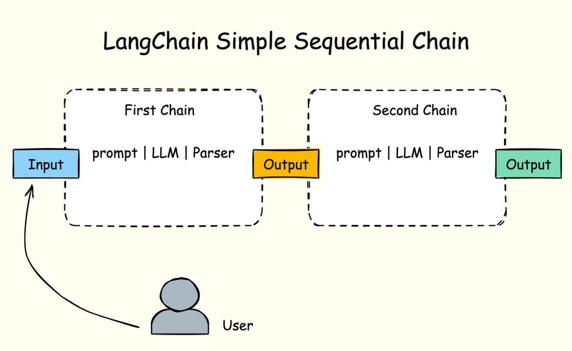
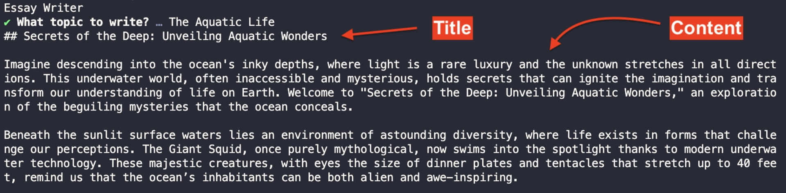

# BAB 7: BAHASA EKSPRESI LANCHAIN (LCEL)

Pada bab sebelumnya, kita memanggil metode prompt.format() di dalam metode llm.invoke() seperti yang ditunjukkan di bawah ini:

```javascript
const response = await llm.invoke(await prompt.format({ country, paragraph, language }))

console.log(response.content)
```

Meskipun teknik ini berfungsi, LangChain sebenarnya menyediakan cara deklaratif untuk mengeksekusi objek prompt dan llm secara berurutan.

Cara deklaratif ini disebut Bahasa Ekspresi LangChain (LCEL untuk singkatnya)

Dengan menggunakan LCEL, Anda dapat membungkus prompt dan objek llm dalam sebuah rantai sebagai berikut:

```javascript
const chain = prompt.pipe(llm)
```

LCEL ditandai dengan metode `pipe()`, yang dapat digunakan untuk membungkus komponen LangChain bersama-sama.

Komponen dalam LangChain termasuk prompt, LLM, rantai itu sendiri, dan parser. Kita akan mempelajari lebih lanjut tentang parser di bagian berikutnya.

Anda dapat memanggil metode `invoke()` dari objek rantai, dan meneruskan input yang diperlukan oleh prompt sebagai objek seperti ini:

```javascript
const response = await chain.invoke({ country, paragraph, language })

console.log(response.content)
```

Objek rantai akan memformat prompt dan kemudian meneruskannya secara otomatis ke objek llm.

Objek respons sama seperti ketika Anda memanggil metode `llm.invoke()`: ini adalah objek pesan dengan jawaban yang disimpan di bawah properti content.

## Rantai Berurutan

Dengan menggunakan LCEL, Anda dapat membuat banyak rantai dan menjalankan prompt berikutnya setelah LLM merespons prompt sebelumnya.

Metode menjalankan prompt berikutnya setelah prompt sebelumnya dijawab ini disebut rantai berurutan (sequential chain).

Berdasarkan input dan output hasil, rantai berurutan dibagi menjadi 2 kategori:

▪ Rantai Berurutan Sederhana (Simple Sequential Chain)

▪ Rantai Berurutan Biasa (Regular Sequential Chain)

Kita akan menjelajahi rantai berurutan biasa di bab berikutnya. Untuk sekarang, mari kita jelajahi rantai berurutan sederhana.

## Rantai Berurutan Sederhana

Rantai berurutan sederhana adalah di mana setiap langkah dalam rantai memiliki satu input/output. Output dari satu langkah akan menjadi input dari prompt berikutnya:

Gambar 26. Ilustrasi Rantai Berurutan Sederhana

Sebagai contoh, misalkan Anda ingin membuat aplikasi yang dapat menulis esai pendek.

Anda akan memberikan topik, dan LLM pertama-tama akan memutuskan judul, dan kemudian melanjutkan dengan menulis esai untuk topik tersebut.



Untuk membuat aplikasi, Anda perlu membuat prompt untuk judul terlebih dahulu:

```javascript
const titlePrompt = new PromptTemplate({
  inputVariables: ["topic"],
  template: `
  Anda adalah seorang jurnalis ahli.

  Anda perlu membuat judul yang menarik untuk topik berikut:
{topic}

  Jawab tepat dengan satu judul
  `,
})
```

TitlePrompt di atas menerima satu variabel input: topik untuk judul yang akan dihasilkannya.

Selanjutnya, Anda perlu membuat prompt untuk esai sebagai berikut:

```javascript
const essayPrompt = new PromptTemplate({
  inputVariables: ["title"],
  template: `
    Anda adalah penulis nonfiksi ahli.

    Anda perlu menulis esai pendek 350 kata untuk judul berikut:

    {title}

    Pastikan esai menarik dan membuat pembaca merasa bersemangat.
  `,
})
```

EssayPrompt ini juga mengambil satu input: judul yang dihasilkan oleh titlePrompt yang kita buat sebelumnya.

Sekarang Anda perlu membuat dua rantai, satu untuk setiap prompt:

```javascript
const firstChain = titlePrompt.pipe(llm).pipe(new StringOutputParser())
const secondChain = essayPrompt.pipe(llm)
```

FirstChain menggunakan kelas StringOutputParser untuk mengurai respons LLM sebagai string, jadi Anda perlu mengimpor parser dari LangChain:

```javascript
import { StringOutputParser } from "@langchain/core/output_parsers"
```

Dengan menggunakan string parser, respons LLM akan diubah dari objek menjadi nilai string tunggal, menghapus metadata yang disertakan dalam respons.

Sekarang Anda dapat menggabungkan firstChain dan secondChain untuk membuat overallChain sebagai berikut:

```javascript
const overallChain = firstChain.pipe((firstChainResponse) => ({ title: firstChainResponse })).pipe(secondChain)
```

Perhatikan bahwa fungsi panah diteruskan dalam metode `pipe()` pertama. Fungsi ini memformat nilai yang dikembalikan oleh firstChain menjadi objek yang dapat diteruskan ke secondChain.

Sekarang Anda memiliki overallChain, mari perbarui pertanyaan prompt untuk hanya menanyakan satu pertanyaan:

```javascript
console.log("Penulis Esai")

const { topic } = await prompts([
  {
    type: "text",
    name: "topic",
    message: "Topik apa yang akan ditulis?",
    validate: (value) => (value ? true : "Topik tidak boleh kosong"),
  },
])

const response = await overallChain.invoke({ topic })
console.log(response.content)
```

Dan Anda selesai. Jika Anda menjalankan aplikasi dan meminta `topic`, Anda akan mendapatkan respons yang mirip dengan ini:

Gambar 27. Hasil Rantai Berurutan Sederhana

Ada beberapa paragraf yang dipotong dari hasil di atas, tetapi Anda sudah dapat melihat bahwa prompt firstChain menghasilkan variabel judul yang digunakan oleh prompt secondChain.

Dengan menggunakan rantai berurutan sederhana, Anda dapat memecah tugas kompleks menjadi urutan tugas yang lebih kecil, meningkatkan akurasi hasil LLM.

## Menggunakan Beberapa LLM dalam Rantai Berurutan

Anda juga dapat menetapkan LLM yang berbeda untuk setiap rantai yang Anda buat menggunakan LCEL.

Kode contoh berikut menjalankan rantai pertama menggunakan Google Gemini, sementara rantai kedua menggunakan OpenAI GPT:

```javascript
const llm = new ChatOpenAI({
  model: "gpt-4o",
  apiKey: process.env.OPENAI_KEY,
})

const llm2 = new ChatGoogleGenerativeAI({
  model: "gemini-2.5-flash",
  apiKey: process.env.GOOGLE_GEMINI_KEY,
})
```



// Gunakan LLM yang berbeda untuk setiap rantai:

```javascript
const firstChain = titlePrompt.pipe(llm).pipe(new StringOutputParser())
const secondChain = essayPrompt.pipe(llm2)
```

Karena LCEL bersifat deklaratif, Anda dapat dengan mudah menukar komponen dalam rantai.

## Debugging Rantai Berurutan

Jika Anda ingin melihat proses rantai berurutan secara lebih detail, Anda dapat mengaktifkan mode debug saat membuat objek llm:

```javascript
const llm = new ChatOpenAI({
  model: "gpt-4o",
  apiKey: process.env.OPENAI_KEY,
  debug: true,
})
```

Ketika Anda menjalankan ulang aplikasi, Anda akan melihat output debug di terminal.

Anda dapat melihat prompt yang dikirim oleh LangChain ke LLM dengan mencari log [llm/start] sebagai berikut:

```
[llm/start] [1:llm:ChatOpenAI] Memasuki run LLM dengan input: {
// ...
}
```

Untuk melihat output, Anda perlu mencari log [llm/end].

Jika Anda mencari input rantai kedua, Anda akan melihat prompt yang didefinisikan sebagai berikut:

```
[llm/start] [1:llm:ChatOpenAI] Memasuki run LLM dengan input: {
"messages": [
[

      {
        "lc": 1,
        "type": "constructor",
        "id": [
          "langchain_core",
          "messages",
          "HumanMessage"
        ],
        "kwargs": {
          "content": "\n  Anda adalah penulis nonfiksi ahli.\n\n    Anda perlu menulis esai pendek 350 kata untuk judul berikut:\n\n    \"Living with Giants: Unraveling the Mysteries of Bears\"\n\n    Pastikan esai menarik dan membuat pembaca merasa bersemangat.\n  ",
          "additional_kwargs": {},
          "response_metadata": {}
        }
      }
    ]

}
}
```

Input untuk prompt kedua diformat sebagai string karena kita menggunakan StrOutputParser() untuk rantai pertama.

Jika Anda tidak mengurai output dari rantai pertama, maka prompt rantai kedua akan terlihat seperti ini:

```
"kwargs": {
"content": "\n Anda adalah penulis nonfiksi ahli.\n\n Anda perlu menulis esai pendek 350 kata untuk judul berikut:\n\n [object Object]\n\n Pastikan esai menarik dan membuat pembaca merasa bersemangat.\n ",
}
```

Perhatikan bahwa respons disematkan ke dalam string sebagai [object Object], jadi LLM mungkin salah memahami permintaan.

Dalam kasus GPT, ia memberi tahu Anda dalam respons:

Maaf, sepertinya ada kesalahan dalam judul yang diberikan.

Mari asumsikan topik yang menarik untuk melanjutkan.

Bagaimana dengan judul ini: "Keajaiban Komputasi Kuantum"?

Dalam kasus saya, saya meminta GPT untuk menulis esai tentang beruang, dan ia secara acak menyarankan judul berdasarkan data pelatihannya.

Untuk meminimalkan jenis respons yang tidak diinginkan ini, Anda perlu mengurai output dari rantai pertama menggunakan parser LangChain.

Kita akan menggunakan parser lain di bab berikutnya.

## Ringkasan

Kode untuk bab ini tersedia di folder 07_LCEL dari kode sumber buku.

Dalam bab ini, Anda telah mempelajari tentang Bahasa Ekspresi LangChain, yang dapat digunakan untuk menyusun komponen LangChain secara deklaratif.

Rantai hanyalah pembungkus untuk komponen LangChain ini:

1. Template prompt

2. LLM yang akan digunakan

3. Parser untuk memproses output dari LLM

Komponen rantai dapat dipertukarkan, artinya Anda dapat menggunakan model GPT untuk prompt pertama, dan kemudian menggunakan model Gemini untuk prompt kedua, seperti yang ditunjukkan di atas.

Dengan menggunakan LCEL, Anda dapat membuat alur kerja yang canggih dan berinteraksi dengan Model Bahasa Besar untuk menyelesaikan tugas yang kompleks.
