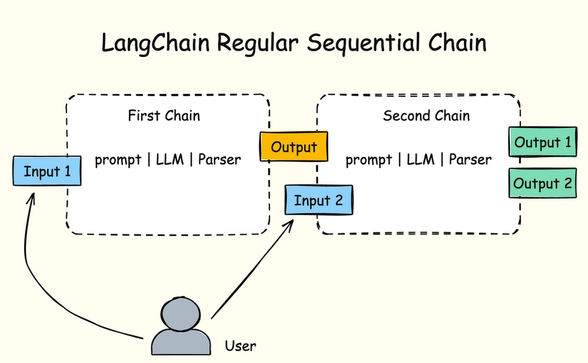
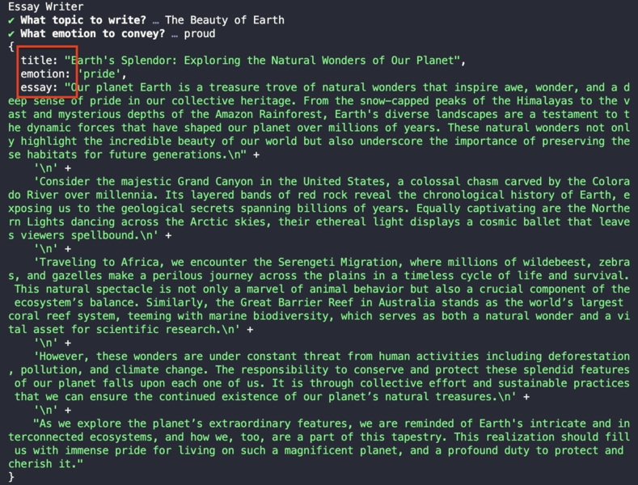

# BAB 8: RANTAI BERURUTAN BIASA

Rantai berurutan biasa adalah bentuk yang lebih umum dari rantai berurutan yang memungkinkan banyak input dan output.

Input untuk rantai berikutnya biasanya merupakan campuran dari output dari rantai sebelumnya dan sumber lain seperti ini:

Gambar 28. Ilustrasi Rantai Berurutan



Rantai ini sedikit lebih rumit daripada rantai berurutan sederhana karena kita perlu melacak banyak input dan output.

Sebagai contoh, misalkan Anda mengubah essayPrompt dari bab sebelumnya untuk memiliki dua inputVariables sebagai berikut:

```javascript
const essayPrompt = new PromptTemplate({
  inputVariables: ["title", "emotion"],
  template: `
  Anda adalah penulis nonfiksi ahli.

    Anda perlu menulis esai pendek 350 kata untuk judul berikut:

    {title}

    Pastikan esai menarik dan membuat pembaca merasa {emotion}.
  `,
})
```

Input emosi yang diperlukan oleh prompt esai tidak berasal dari rantai pertama, yang hanya mengembalikan variabel judul.

Anda perlu menyuntikkan input emosi saat membuat overallChain sebagai berikut:

```javascript
const overallChain = firstChain
  .pipe((result) => ({
    title: result,
    emotion,
  }))
  .pipe(secondChain)
```

Dengan cara ini, input judul diperoleh dari output firstChain, sementara input emosi berasal dari sumber lain.

Sekarang Anda perlu menanyakan input emosi kepada pengguna:

```javascript
console.log("Penulis Esai")
```

```javascript
const questions = [
  {
    type: "text",
    name: "topic",
    message: "Topik apa yang akan ditulis?",
    validate: (value) => (value ? true : "Topik tidak boleh kosong"),
  },
  {
    type: "text",
    name: "emotion",
    message: "Emosi apa yang ingin disampaikan?",
    validate: (value) => (value ? true : "Emosi tidak boleh kosong"),
  },
]

const { topic, emotion } = await prompts(questions)
```

Dan sekarang Anda memiliki dua input untuk rantai kedua: `title` dan `emotion`.

Pastikan bahwa overallChain dideklarasikan di bawah baris await `prompts()`.

## Format Variabel Output

Rantai berurutan biasanya juga melacak banyak variabel output.

Untuk melacak banyak variabel output, Anda dapat menggunakan StructuredOutputParser dari LangChain untuk memformat output sebagai objek JSON.

Pertama, impor parser dari LangChain:

```javascript
import { StringOutputParser, StructuredOutputParser } from "@langchain/core/output_parsers"
```

Selanjutnya, buat parser yang berisi skema output sebagai objek.

Misalkan Anda ingin menampilkan nilai judul, emosi, dan esai dalam respons.

Panggil metode `StructuredOutputParser.fromNamesAndDescriptions()` dan berikan skema sebagai berikut:

```javascript
const firstChain = titlePrompt.pipe(llm).pipe(new StringOutputParser())

const structuredParser = StructuredOutputParser.fromNamesAndDescriptions({
  title: "judul esai",
  emotion: "emosi yang disampaikan oleh esai",
  essay: "konten esai",
})
```

Setelah itu, masukkan parser ke dalam secondChain sebagai berikut:

```javascript
const secondChain = essayPrompt.pipe(llm).pipe(structuredParser)
```

Sekarang LLM diinstruksikan untuk mengurai output menggunakan `structuredParser`.

Dalam `essayPrompt`, perbarui kedua parameter inputVariables dan template untuk menyertakan input `format_instructions`:

```javascript
const essayPrompt = new PromptTemplate({
  inputVariables: ["title", "emotion", "format_instructions"],
  template: `
  Anda adalah penulis nonfiksi ahli.

    Anda perlu menulis esai pendek 350 kata untuk judul berikut:

    {title}

    Pastikan esai menarik dan membuat pembaca merasa {emotion}.

    {format_instructions}
  `,
})
```

Untuk langkah terakhir, berikan input `format_instructions` dengan memanggil metode `structuredParser.getFormatInstructions()` saat membuat objek `overallChain`:

```javascript
const overallChain = firstChain
  .pipe((result) => ({
    title: result,
    emotion,
    format_instructions: structuredParser.getFormatInstructions(),
  }))
  .pipe(secondChain)
```

Metode `getFormatInstructions()` mengembalikan string yang berisi instruksi dan skema JSON. Anda dapat melihat string tersebut dengan memanggil `console.log()` jika ingin:

```javascript
console.log(structuredParser.getFormatInstructions())
```

Sekarang Anda dapat menjalankan aplikasi dan memberikan input judul dan emosi untuk esai. LLM akan mengembalikan objek JavaScript:

Gambar 29. Menerima Output JSON

Jika Anda ingin menulis setiap variabel output, Anda dapat mengakses propertinya secara langsung sebagai berikut:

```javascript
const response = await overallChain.invoke({
  topic,
})
console.log(response.title)
console.log(response.emotion)
console.log(response.essay)
```

Sekarang Anda memiliki rantai berurutan yang melacak banyak input dan output. Sangat bagus!



## Ringkasan

Kode untuk bab ini tersedia di folder 08_Sequential_Chain dari kode sumber buku.

Ketika Anda membuat rantai berurutan, Anda dapat menambahkan input tambahan ke rantai berikutnya yang tidak berasal dari rantai sebelumnya.

Anda juga dapat memformat output sebagai objek JSON untuk membuat respons lebih terorganisir dan lebih mudah diproses.
