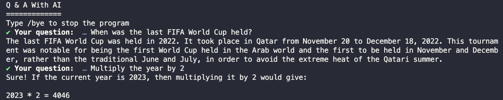

# BAB 9: MENERAPKAN RIWAYAT OBROLAN DI LANGCHAIN

Sejauh ini, LLM mengambil pertanyaan yang kita ajukan dan memberikan jawaban yang diambil dari data pelatihan.

Kembali ke aplikasi tanya jawab sederhana di Bab 5, Anda dapat mencoba mengajukan pertanyaan kepada LLM seperti:

```
1. Kapan Piala Dunia FIFA terakhir diadakan?
2. Kalikan tahunnya dengan 2
```

Pada saat penulisan ini, Piala Dunia FIFA terakhir diadakan pada tahun 2022. Membaca prompt kedua di atas, kita dapat memahami bahwa 'tahun' merujuk pada '2022'.

Namun, karena LLM tidak memiliki kesadaran tentang interaksi sebelumnya, jawabannya tidak akan terkait.

Dengan GPT, LLM merujuk pada tahun saat ini alih-alih tahun Piala Dunia FIFA terakhir:

Gambar 30. Contoh LLM Keluar dari Konteks



LLM tidak dapat memahami bahwa kita memberikan instruksi tindak lanjut untuk pertanyaan sebelumnya.

Untuk mengatasi masalah ini, Anda perlu menyimpan pesan-pesan sebelumnya dan menggunakannya saat mengirim prompt baru.

Untuk mengikuti bab ini, Anda dapat menyalin kode dari Bab 5 dan menggunakannya sebagai awal.

## Membuat Template Prompt Obrolan

Pertama, Anda perlu membuat template prompt obrolan yang memiliki riwayat obrolan yang disuntikkan ke dalamnya.

Template prompt obrolan berbeda dari template prompt biasa. Template ini menerima array pesan, dan setiap pesan dapat dikaitkan dengan peran tertentu.

Berikut adalah contoh template prompt obrolan:

```javascript
import { ChatPromptTemplate } from "@langchain/core/prompts"

const chatTemplate = ChatPromptTemplate.fromMessages([
  ["system", "Anda adalah bot AI yang membantu. Nama Anda adalah {name}"],
  ["human", "Halo, apa kabar?"],
  ["ai", "Saya baik-baik saja, terima kasih!"],
  ["human", "{input}"],
])
```

Pada contoh di atas, pesan dikaitkan dengan peran `'system'`, `'human'`, dan `'ai'`. Pesan `'system'` digunakan untuk mempengaruhi perilaku AI.

Anda dapat menggunakan kelas `ChatPromptTemplate` dan `MessagesPlaceholder` untuk membuat prompt yang menerima riwayat obrolan sebagai berikut:

```javascript
import { ChatPromptTemplate, MessagesPlaceholder } from "@langchain/core/prompts"

const prompt = ChatPromptTemplate.fromMessages([
  [
    "system",
    `Anda adalah chatbot AI yang sedang bercakap-cakap dengan manusia.
     Gunakan konteks berikut untuk memahami pertanyaan manusia.
     Jangan sertakan emoji dalam jawaban Anda`,
  ],
  new MessagesPlaceholder("chatHistory"),
  ["human", "{input}"],
])
```

Kelas `MessagesPlaceholder` bertindak sebagai pembuka di mana Anda dapat menyuntikkan riwayat obrolan. Anda perlu meneruskan kunci string yang menyimpan riwayat obrolan saat menginstansiasi kelas.

## Menyimpan Pesan di LangChain

Untuk menyimpan pesan obrolan di LangChain, Anda dapat menggunakan kelas ChatMessageHistory yang disediakan:

```javascript
import { ChatMessageHistory } from "langchain/memory"

const history = new ChatMessageHistory()
```

Kelas `ChatMessageHistory` menyediakan metode untuk `get`, `add`, dan `clear` pesan.

Tetapi Anda tidak akan memanipulasi objek history secara langsung. Sebaliknya, Anda perlu meneruskan objek ke kelas RunnableWithMessageHistory ini.

Kelas `RunnableWithMessageHistory` membuat rantai yang menyuntikkan riwayat obrolan untuk Anda. Ini juga akan menambahkan pesan baru secara otomatis saat Anda memanggil rantai:

```javascript
const chain = prompt.pipe(llm)

const chainWithHistory = new RunnableWithMessageHistory({
  runnable: chain,
  getMessageHistory: (sessionId) => history,
  inputMessagesKey: "input",
  historyMessagesKey: "chatHistory",
})
```

Saat membuat objek `RunnableWithMessageHistory`, Anda perlu meneruskan rantai yang ingin Anda suntikkan riwayatnya (`runnable`) dan fungsi yang mengembalikan riwayat obrolan (`getMessageHistory`).

`inputMessagesKey` adalah kunci input yang ada dalam prompt, sementara `historyMessagesKey` adalah variabel yang menerima riwayat (harus sama dengan kunci string yang diteruskan ke `MessagesPlaceholder` dalam prompt)

Sekarang objek `chainWithHistory` telah dibuat, Anda dapat menguji AI dan melihat apakah ia sadar akan percakapan sebelumnya. Gunakan loop while di sini untuk menampilkan input lagi:

```javascript
console.log("Mengobrol dengan AI")
console.log("Ketik /bye untuk menghentikan program")

let exit = false
while (!exit) {
  const { question } = await prompts([
    {
      type: "text",
      name: "question",
      message: "Pertanyaan Anda: ",
      validate: (value) => (value ? true : "Pertanyaan tidak boleh kosong"),
    },
  ])
  if (question == "/bye") {
    console.log("Sampai jumpa!")
    exit = true
  } else {
    const response = await chainWithHistory.invoke(
      { input: question },
      {
        configurable: {
          sessionId: "test",
        },
      }
    )
    console.log(response.content)
  }
}
```

Saat memanggil objek `chainWithHistory`, Anda perlu meneruskan kunci sessionId ke parameter config seperti yang ditunjukkan di atas.

`sessionId` dapat berupa nilai string apa pun.

Sekarang Anda dapat menguji aplikasi dengan memberikan pertanyaan tindak lanjut:

```
Q: Kapan Piala Dunia FIFA terakhir diadakan?
A: Piala Dunia FIFA terakhir diadakan pada tahun 2022 di Qatar.
Q: Kalikan tahunnya dengan 2
A: Mengalikan tahun 2022 dengan 2 menghasilkan 4044.
```

Karena riwayat obrolan disuntikkan ke dalam prompt, LLM dapat menempatkan pertanyaan kedua dalam konteks yang pertama.

Jika Anda meneruskan opsi verbose ke LLM:

```javascript
const llm = new ChatOpenAI({
  model: "gpt-4o",
  apiKey: process.env.OPENAI_KEY,
  verbose: true,
})
```

Anda akan melihat riwayat obrolan diteruskan saat Anda menjalankan pertanyaan kedua di dalam array pesan:

```
[llm/start] [1:llm:ChatOpenAI] Memasuki run LLM dengan input: {
  "messages": [
    ... objek yang berisi pesan obrolan sebelumnya
  ]
}
```

Pesan-pesan sebelumnya ini disuntikkan oleh rantai `chainWithHistory` ke dalam prompt.

## Ringkasan

Kode untuk bab ini tersedia di folder `09_Chat_History` dari kode sumber buku.

Dalam bab ini, Anda telah mempelajari cara menyuntikkan riwayat obrolan ke dalam prompt menggunakan kelas `RunnableWithMessageHistory` dari LangChain.

Menambahkan riwayat obrolan memungkinkan AI untuk mengontekstualisasikan pertanyaan Anda berdasarkan pesan-pesan sebelumnya.

Menggabungkan riwayat obrolan dengan prompt, Anda dapat mengobrol dengan AI secara terus-menerus sambil mempertahankan interaksi sebelumnya.
