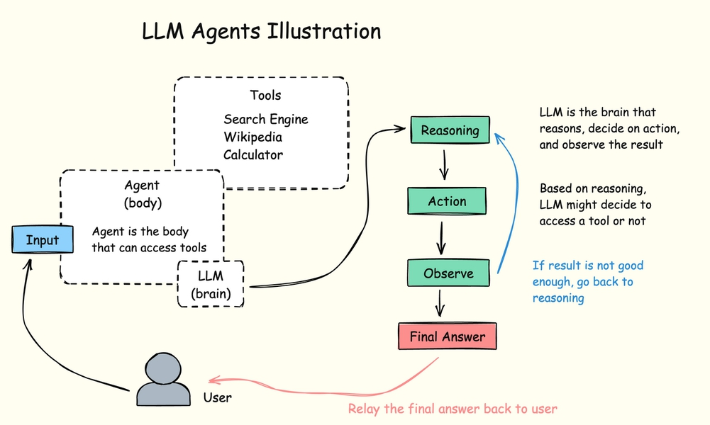
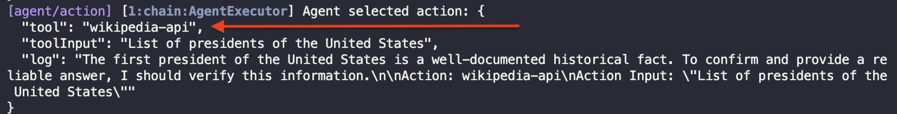
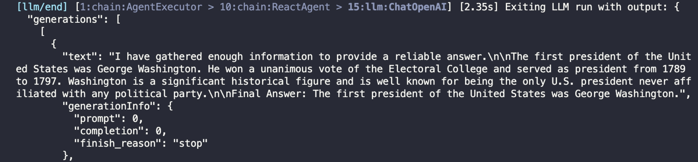
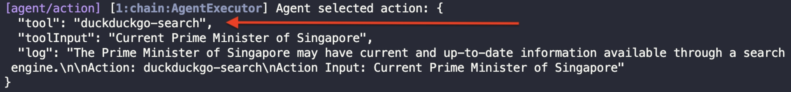
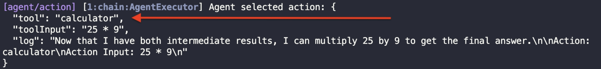
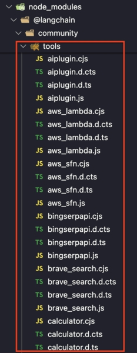

# BAB 10: AGEN AI DAN ALAT

Agen AI adalah perangkat lunak berpikir yang mampu menyelesaikan tugas melalui serangkaian tindakan. Ia menggunakan LLM sebagai mesin penalaran untuk merencanakan dan mengeksekusi tindakan.

Yang perlu Anda lakukan hanyalah memberi agen tugas tertentu. Agen akan memproses tugas, menentukan tindakan yang diperlukan untuk menyelesaikannya, lalu mengambil tindakan tersebut.

Agen juga dapat menggunakan alat untuk mengambil tindakan di dunia nyata, seperti mencari informasi spesifik di internet.

Berikut ilustrasi untuk membantu Anda memahami konsep agen:

Gambar 31. Ilustrasi Agen LLM



Tidak semua LLM mampu membuat agen, jadi model canggih seperti GPT-4, Gemini 2.5 Pro, atau Mistral diperlukan.

Mari saya tunjukkan cara membuat agen menggunakan LangChain selanjutnya.

## Membuat Agen AI Dengan LangChain

Buat file JavaScript baru bernama react_agent.js dan impor modul berikut:

```javascript
import { pull } from "langchain/hub"
import { ChatOpenAI } from "@langchain/openai"
import { AgentExecutor, createReactAgent } from "langchain/agents"
import { DuckDuckGoSearch } from "@langchain/community/tools/duckduckgo_search"
import { WikipediaQueryRun } from "@langchain/community/tools/wikipedia_query_run"
import { Calculator } from "@langchain/community/tools/calculator"
import "dotenv/config"
import prompts from "prompts"
```

`dotenv` dan `ChatOpenAI` sudah digunakan sebelumnya, tetapi sisanya adalah modul baru yang digunakan untuk membuat agen AI.

Fungsi pull digunakan untuk mengambil prompt dari hub komunitas LangChain. Anda dapat mengunjungi hub di https://smith.langchain.com/hub

Hub komunitas LangChain adalah kumpulan terbuka prompt yang dapat Anda gunakan gratis dalam proyek Anda.

Modul `createReactAgent` membuat agen yang menggunakan prompting `ReAct`, sedangkan `AgentExecutor` mengelola eksekusi agen, seperti memproses input, menghasilkan respons, dan memperbarui status agen.

Selanjutnya, inisialisasi llm dan dapatkan prompt dari hub sebagai berikut:

```javascript
const llm = new ChatOpenAI({
  model: "gpt-4o",
  apiKey: process.env.OPENAI_KEY,
})

const prompt = await pull("hwchase17/react")
```

Fungsi `pull()` mengambil prompt dari repositori yang Anda tentukan sebagai argumennya. Di sini, kami menggunakan prompt "react" yang dibuat oleh pengguna `"hwchase17"`.

Jika Anda ingin melihat promptnya, Anda dapat mengunjungi https://smith.langchain.com/hub/hwchase17/react

Selanjutnya, instansiasi alat yang ingin kami sediakan untuk LLM, lalu buat objek eksekutor agen sebagai berikut:

```javascript
const wikipedia = new WikipediaQueryRun()

const ddgSearch = new DuckDuckGoSearch({ maxResults: 3 })

const calculator = new Calculator()

const tools = [wikipedia, ddgSearch, calculator]

const agent = await createReactAgent({ llm, tools, prompt })

const agentExecutor = new AgentExecutor({
  agent,
  tools,
  verbose: true, // tampilkan log
})
```

Ada tiga alat yang kami sediakan untuk agen:

1. `wikipedia` untuk mengakses dan meringkas artikel Wikipedia
2. `ddgSearch` untuk mencari di internet menggunakan mesin pencari DuckDuckGo
3. `calculator` untuk menghitung persamaan matematika

Untuk menjalankan alat pencarian DuckDuckGo, Anda perlu menginstal paket duck-duck-scrape menggunakan npm:

`npm install duck-duck-scrape`

Alat lainnya sudah tersedia dari modul `@langchain/community`.

Setelah instalasi selesai, lengkapi agen dengan menambahkan prompt pertanyaan dan panggil metode `invoke()`:

```javascript
const { question } = await prompts([
  {
    type: "text",
    name: "question",
    message: "Pertanyaan Anda: ",
    validate: (value) => (value ? true : "Pertanyaan tidak boleh kosong"),
  },
])

const response = await agentExecutor.invoke({ input: question })
console.log(response)
```

Agen AI sekarang selesai. Anda dapat menjalankan agen menggunakan Node.js sebagai berikut:

`node react_agent.js`

Sekarang berikan tugas untuk diselesaikan agen, seperti '`Siapa presiden pertama Amerika?`'

Karena parameter verbose disetel true di `AgentExecutor`, Anda akan melihat penalaran dan tindakan yang diambil oleh LLM:

Gambar 32. Agen LLM Berpikir dan Melakukan Tindakan



LLM akan mengambil tindakan menggunakan agen yang telah kita buat untuk mencari jawaban akhir.

Log berikut menunjukkan pemikiran yang dilakukan oleh LLM:

Gambar 33. Agen LLM Selesai



Setelah agen selesai berjalan, ia akan mengembalikan objek dengan dua properti: input dan output seperti yang ditunjukkan di bawah:

```json
{
  "input": "Who was the first president of America?",
  "output": "The first president of the United States was George Washington."
}
```

Jika LLM yang Anda gunakan sudah memiliki jawaban dalam data pelatihannya, Anda mungkin melihat output segera tanpa log [agent/action].

Misalnya, saya bertanya 'Kapan Hari Kemerdekaan Amerika?' di bawah:

```
Pertanyaan Anda: … Kapan Hari Kemerdekaan Amerika?
```

Hari Kemerdekaan Amerika adalah peristiwa sejarah terkenal yang tidak memerlukan pencarian pembaruan terkini atau informasi detail dari ensiklopedia.

Ini adalah informasi yang umum diketahui.

```
Jawaban Akhir: Hari Kemerdekaan Amerika adalah pada 4 Juli.
```

```json
{
  "input": "When is America Independence Day?",
  "output": "America's Independence Day is on July 4th."
}
```

Karena jawaban sudah ada dalam data pelatihannya, LLM memutuskan untuk menjawab langsung.

Mengajukan Pertanyaan Berbeda kepada Agen

Anda sekarang dapat mengajukan berbagai jenis pertanyaan untuk melihat apakah LLM cukup pintar untuk menggunakan alat yang tersedia.

Jika Anda bertanya 'Siapa Perdana Menteri Singapura saat ini?', LLM seharusnya menggunakan pencarian DuckDuckGo untuk mencari informasi terbaru:

Gambar 34. Agen LLM Melakukan Pencarian



Jika Anda bertanya pertanyaan matematika seperti 'Ambil 5 pangkat 2 lalu kalikan dengan jumlah enam dan tiga', agen seharusnya menggunakan alat kalkulator:

Gambar 35. Agen LLM Melakukan Matematika



LLM terbaru cukup pintar untuk memahami maksud pertanyaan dan memilih alat yang tepat untuk pekerjaan tersebut.

Daftar Alat AI yang Tersedia

Agen AI hanya dapat menggunakan alat yang Anda tambahkan saat Anda membuat agen.

Daftar alat yang disediakan oleh LangChain dapat ditemukan di https://js.langchain.com/v0.2/docs/integrations/tools.

Namun, beberapa alat seperti Calculator dan BingSerpAPI tidak terdaftar di halaman integrasi di atas, jadi Anda perlu menyelami kode sumber paket komunitas LangChain untuk menemukan semua alat yang tersedia.

Cukup buka folder node_modules/@langchain/community/tools, lalu masuk ke folder tools, dan Anda akan melihat semua alat di sana:

Gambar 36. Alat Tersedia untuk Agen LLM



Anda dapat melihat alat lain seperti pencarian Google dan Bing di sini, tetapi alat-alat ini memerlukan kunci API untuk dijalankan.

## Jenis-jenis Agen AI

Ada beberapa jenis agen AI yang diidentifikasi saat ini, dan yang kita buat disebut agen ReAct (Reason + Act).

Agen ReAct adalah agen serbaguna, dan ada agen yang lebih khusus seperti agen XML dan agen JSON.

Anda dapat membaca lebih lanjut tentang berbagai jenis agen di https://js.langchain.com/v0.1/docs/modules/agents/agent_types/

Seiring LLM dan LangChain meningkat, jenis agen baru mungkin dibuat, sehingga definisi di atas tidak akan selalu relevan.

## Ringkasan

Kode untuk bab ini tersedia di folder `10_Agents_and_Tools` dari kode sumber buku.

Meskipun kita belum memiliki asisten robot otonom (masih) di dunia kita saat ini, kita sudah dapat melihat bagaimana pengembangan agen AI suatu hari nanti dapat digunakan sebagai otak robot AI.

Agen AI adalah inovasi luar biasa yang menunjukkan bagaimana mesin dapat menghasilkan serangkaian tindakan untuk mencapai tujuan.

Saat Anda membuat agen, LLM digunakan sebagai mesin penalaran yang perlu menghasilkan langkah-langkah logika untuk menyelesaikan tugas.

Agen juga dapat menggunakan berbagai alat untuk bertindak, seperti menjelajah web atau memecahkan persamaan matematika.

Tugas yang lebih kompleks yang menggunakan banyak alat juga dapat dieksekusi oleh agen-agen ini.

Terkadang, LLM yang terlatih dengan baik dapat menjawab langsung dari data pelatihan, melewati kebutuhan untuk menggunakan alat.
