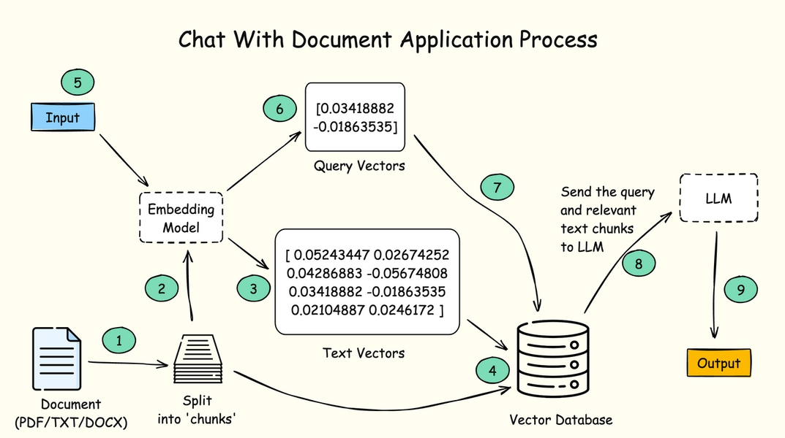

# BAB 11: INTERAKSI DENGAN DOKUMEN DI LANGCHAIN

Salah satu kasus penggunaan AI yang paling menarik adalah fitur Chat With Document, yang memungkinkan pengguna berinteraksi dengan dokumen menggunakan kueri percakapan.

Dengan hanya mengajukan pertanyaan, pengguna dapat dengan cepat menemukan informasi relevan, merangkum konten, dan mendapatkan wawasan tanpa harus membaca dan menyortir halaman-halaman teks.

Berikut ilustrasi proses yang diperlukan untuk membuat aplikasi Chat With Document:

Gambar 37. Proses Aplikasi Chat With Document



Pertama-tama Anda perlu membagi satu dokumen menjadi potongan-potongan (chunks) agar dokumen dapat diproses dan diindeks secara efektif. Potongan tersebut kemudian diubah menjadi embedding vektor.

Embedding vektor adalah larik angka yang merepresentasikan informasi berbagai jenis, termasuk teks, gambar, audio, dan lainnya, dengan menangkap fitur-fitur mereka dalam format numerik.

Ketika Anda memberikan pertanyaan, LangChain akan mengubah kueri menjadi vektor, lalu mencari vektor dokumen untuk kecocokan yang paling relevan.

LangChain kemudian mengirim kueri pengguna dan potongan teks relevan ke LLM agar LLM dapat menghasilkan respons berdasarkan input yang diberikan.

Proses menemukan informasi teks yang relevan dan mengirimkannya ke LLM juga dikenal sebagai Retrieval Augmented Generation,

atau disingkat RAG.

Dengan menggunakan LangChain, Anda dapat membuat aplikasi yang memproses dokumen sehingga Anda dapat menanyakan pertanyaan kepada LLM yang relevan dengan konten dokumen tersebut.

Mari kita mulai.

## Mendapatkan Dokumen

Anda akan mengunggah dokumen ke aplikasi dan mengajukan pertanyaan tentangnya. Anda bisa mendapatkan file teks bernama ai-discussion.txt dari folder kode sumber.

File teks berisi cerita fiksi yang membahas dampak AI terhadap kemanusiaan.

Karena bersifat fiksi, Anda dapat memastikan bahwa LLM memperoleh jawaban dari dokumen dan bukan dari data pelatihannya.

## Membangun Aplikasi Chat With Document

Buat file JavaScript baru bernama rag_app.js, lalu impor paket yang diperlukan untuk aplikasi Chat With Document sebagai berikut:

```javascript
import { ChatOpenAI, OpenAIEmbeddings } from "@langchain/openai"
import { ChatPromptTemplate } from "@langchain/core/prompts"
import prompts from "prompts"

// Paket baru:
import { TextLoader } from "langchain/document_loaders/fs/text"
import { RecursiveCharacterTextSplitter } from "@langchain/textsplitters"
import { MemoryVectorStore } from "langchain/vectorstores/memory"
import { createRetrievalChain } from "langchain/chains/retrieval"
import { createStuffDocumentsChain } from "langchain/chains/combine_documents"

import "dotenv/config"
```

Kelas `OpenAIEmbeddings` digunakan untuk mengakses model embedding OpenAI.

Kelas `TextLoader` digunakan untuk memuat file teks, sedangkan `RecursiveCharacterTextSplitter` digunakan untuk membagi teks menjadi potongan-potongan kecil agar dapat diproses lebih efisien oleh LLM.

Kelas `MemoryVectorStore` digunakan untuk menyimpan data vektor di memori. `createRetrievalChain` mengambil dokumen dan meneruskannya ke `createStuffDocumentsChain`, yang meneruskan dokumen ke LLM.

Dengan paket-paket yang diimpor, Anda dapat mendefinisikan llm berikutnya seperti yang ditunjukkan di bawah:

```javascript
const llm = new ChatOpenAI({
  model: "gpt-4o",
  apiKey: process.env.OPENAI_KEY,
})
```

Setelah llm, muat teks menggunakan TextLoader dan berikan path ke dokumen di `TextLoader` sebagai berikut:

```javascript
const loader = new TextLoader("./ai-discussion.txt")
const docs = await loader.load()
```

Dokumen akan berupa array dari objek Document. Sekarang Anda perlu membuat pembagi teks dan membagi dokumen menjadi potongan-potongan:

```javascript
const splitter = new RecursiveCharacterTextSplitter({
  chunkSize: 1000,
  chunkOverlap: 200,
})

const chunks = await splitter.splitDocuments(docs)
```

Untuk mengubah potongan dokumen menjadi vektor, Anda perlu menggunakan model embedding.

OpenAI menyediakan endpoint API untuk mengubah dokumen menjadi vektor, dan LangChain menyediakan kelas `OpenAIEmbeddings` sehingga Anda dapat menggunakan embedding ini dengan mudah.

Tambahkan kode berikut di bawah variabel chunks:

```javascript
const embeddings = new OpenAIEmbeddings({ apiKey: process.env.OPENAI_KEY })

const vectorStore = await MemoryVectorStore.fromDocuments(chunks, embeddings)

const retriever = vectorStore.asRetriever()
```

Metode `MemoryVectorStore.fromDocuments()` mengirimkan potongan dan data embedding ke penyimpan vektor.

Selanjutnya, Anda perlu memanggil metode `asRetriever()` untuk membuat objek retriever, yang menerima input pengguna dan mengembalikan potongan dokumen yang relevan.

Setelah itu, Anda perlu membuat prompt untuk dikirim ke LLM:

```javascript
const systemPrompt = `Anda adalah asisten untuk tugas tanya-jawab.
  Gunakan potongan konteks yang diambil berikut untuk menjawab
  pertanyaan. Jika Anda tidak tahu jawabannya, katakan bahwa Anda
  tidak tahu. Gunakan maksimal tiga kalimat dan buat jawabannya
  ringkas.
  \n\n
  {context}`

const prompt = ChatPromptTemplate.fromMessages([
  ["system", systemPrompt],
  ["human", "{input}"],
])
```

Dengan prompt yang dibuat, Anda perlu membuat chain dengan memanggil fungsi `createStuffDocumentsChain()` dan meneruskan llm dan prompt seperti ini:

```javascript
const questionAnswerChain = await createStuffDocumentsChain({
  llm: llm,
  prompt: prompt,
})
```

`questionAnswerChain` ini akan menangani pengisian template prompt dan pengiriman prompt ke LLM.

Selanjutnya, teruskan `questionAnswerChain` ke fungsi `createRetrievalChain()`:

```javascript
const ragChain = await createRetrievalChain({
  retriever: retriever,
  combineDocsChain: questionAnswerChain,
})
```

`ragChain` di atas akan meneruskan input ke retriever, yang mengembalikan bagian relevan dari dokumen ke chain.

Bagian relevan dari chain dan input kemudian diteruskan ke `questionAnswerChain` untuk mendapatkan hasil.

Sekarang Anda dapat meminta input pengguna, lalu jalankan metode `invoke()` dengan input tersebut:

```javascript
const { question } = await prompts([
  {
    type: "text",
    name: "question",
    message: "Pertanyaan Anda: ",
    validate: (value) => (value ? true : "Pertanyaan tidak boleh kosong"),
  },
])

const response = await ragChain.invoke(
  { input: question },
  {
    configurable: {
      sessionId: "test",
    },
  }
)
console.log(response.answer)
```

Ketika LLM mengembalikan jawaban, Anda mencetak jawaban ke baris perintah.

Sekarang aplikasi selesai. Anda dapat menjalankannya menggunakan Node.js dari baris perintah:

`node rag_app.js`

Kemudian ajukan pertanyaan yang relevan dengan konteks dokumen. Berikut contohnya:

`node rag_app.js`

```
Pertanyaan Anda: … Di mana Mr. Thompson bekerja?
Mr. Thompson bekerja di VegaTech Inc. sebagai Kepala Ilmuwan AI.
```

Seperti yang kita lihat, LLM dapat menjawab pertanyaan dengan menganalisis prompt yang dibuat oleh LangChain dan input kita.

## Menambahkan Memori Obrolan untuk Konteks

Untuk menambahkan memori obrolan ke chain RAG, Anda perlu meningkatkan objek retriever dengan membuat retriever yang sadar riwayat.

Retriever yang sadar riwayat ini kemudian digunakan untuk mengontekstualisasikan pertanyaan terbaru Anda dengan menganalisis riwayat obrolan.

Anda perlu mengimpor chain `createHistoryAwareRetriever`, lalu membuat objek `createHistoryAwareRetriever` sebagai berikut:

```javascript
import { createHistoryAwareRetriever } from "langchain/chains/history_aware_retriever"

// ... kode lainnya

const retriever = vectorStore.asRetriever()

const contextualizeSystemPrompt = `
Diberikan riwayat obrolan dan pertanyaan pengguna terbaru
yang mungkin merujuk konteks dalam riwayat obrolan, rumuskan pertanyaan mandiri
yang dapat dipahami tanpa riwayat obrolan. JANGAN jawab pertanyaan,
hanya reformulasikan jika diperlukan dan selain itu kembalikan sebagaimana adanya.
`

const contextualizePrompt = ChatPromptTemplate.fromMessages([["system", contextualizeSystemPrompt], new MessagesPlaceholder("chat_history"), ["human", "{input}"]])

const historyAwareRetriever = await createHistoryAwareRetriever({
  llm,
  retriever,
  rephrasePrompt: contextualizePrompt,
})
```

`contextualizePrompt` digunakan untuk membuat LLM merumuskan ulang pertanyaan dalam konteks riwayat obrolan.

Prompt tersebut diteruskan ke objek `createHistoryAwareRetriever`.

Selanjutnya, Anda perlu menambahkan `MessagesPlaceholder` ke objek prompt juga:

```javascript
const prompt = ChatPromptTemplate.fromMessages([["system", systemPrompt], new MessagesPlaceholder("chat_history"), ["human", "{input}"]])
```

Setelah itu, perbarui `ragChain` untuk menggunakan `historyAwareRetriever` sebagai berikut:

```javascript
const ragChain = await createRetrievalChain({
  retriever: historyAwareRetriever,
  combineDocsChain: questionAnswerChain,
})
```

Sekarang setelah Anda memiliki chain RAG yang diperbarui, teruskan chain ke kelas `RunnableWithMessageHistory()` seperti yang kita lakukan di Bab 9:

```javascript
// Tambahkan impor
import { ChatMessageHistory } from "langchain/memory"
import { RunnableWithMessageHistory } from "@langchain/core/runnables"

// ... kode lainnya

const ragChain = await createRetrievalChain({
  retriever: historyAwareRetriever,
  combineDocsChain: questionAnswerChain,
})

const history = new ChatMessageHistory()

const conversationalRagChain = new RunnableWithMessageHistory({
  runnable: ragChain,
  getMessageHistory: (sessionId) => history,
  inputMessagesKey: "input",
  historyMessagesKey: "chat_history",
  outputMessagesKey: "answer",
})
```

Sebagai langkah terakhir, ubah chain yang dipanggil ketika aplikasi menerima pertanyaan menjadi `conversationalRagChain`, dan tambahkan parameter configurable untuk sessionId.

Untuk mengulangi prompt, tambahkan loop while seperti sebelumnya:

```javascript
let exit = false
while (!exit) {
  const { question } = await prompts([
    {
      type: "text",
      name: "question",
      message: "Pertanyaan Anda: ",
      validate: (value) => (value ? true : "Pertanyaan tidak boleh kosong"),
    },
  ])
  if (question == "/bye") {
    console.log("Sampai jumpa!")
    exit = true
  } else {
    const response = await conversationalRagChain.invoke(
      { input: question },
      {
        configurable: {
          sessionId: "test",
        },
      }
    )
    console.log(response.answer)
  }
}
```

Sekarang kita dapat berinteraksi dengan dokumen, dan AI menyadari riwayat obrolan. Kerja bagus!

## Tentang Basis Data Vektor

Kami telah menggunakan `MemoryVectorStore` untuk menyimpan data vektor dalam aplikasi ini, tetapi penyimpanan ini sebenarnya tidak direkomendasikan untuk produksi.

Ketika aplikasi berhenti berjalan, data vektor di memori akan hilang.

Kebanyakan aplikasi basis data modern seperti PostgreSQL, Redis, dan MongoDB mendukung penyimpanan data vektor, jadi Anda mungkin ingin menggunakannya di produksi.

Anda dapat melihat detail integrasi basis data vektor di https://js.langchain.com/v0.2/docs/integrations/vectorstores/

Basis data `MemoryVectorStore` hanya direkomendasikan untuk prototyping dan pengujian.

## Mengganti LLM

Jika Anda ingin mengubah LLM yang digunakan untuk aplikasi ini, Anda juga perlu mengubah model embedding yang digunakan untuk pembuatan vektor.

Untuk Google Gemini, Anda dapat mengimpor model `GoogleGenerativeAIEmbeddings` sebagai berikut:

```javascript
import { ChatGoogleGenerativeAI, GoogleGenerativeAIEmbeddings } from "@langchain/google-genai"

// llm
const llm = new ChatGoogleGenerativeAI({
  model: "gemini-2.5-flash",
  apiKey: process.env.GOOGLE_GEMINI_KEY,
})

// embeddings
const embeddings = new GoogleGenerativeAIEmbeddings({
  apiKey: process.env.GOOGLE_GEMINI_KEY,
  modelName: "embedding-001",
})
```

Untuk Ollama, Anda dapat menggunakan kelas `OllamaEmbeddings` yang dikembangkan komunitas seperti ini:

```javascript
import { ChatOllama } from "@langchain/community/chat_models/ollama"
import { OllamaEmbeddings } from "@langchain/community/embeddings/ollama"

// llm
const llm = new ChatOllama({ model: "mistral" })

// embeddings
const embeddings = new OllamaEmbeddings({ model: "mistral" })
```

Pastikan Anda menggunakan model yang sama saat membuat instansi kelas `ChatOllama` dan `OllamaEmbeddings`.

## Ringkasan

Kode untuk bab ini tersedia di folder `11_Chat_With_Document` dari kode sumber buku.

Dalam bab ini, Anda telah belajar cara membuat aplikasi Chat With Document menggunakan LangChain.

Dengan teknik RAG, LangChain dapat digunakan untuk mengambil informasi dari dokumen, lalu meneruskan informasi tersebut ke LLM.

Hal pertama yang perlu Anda lakukan adalah memproses dokumen dan mengubahnya menjadi potongan, yang kemudian dapat diubah menjadi vektor menggunakan model embedding.

Vektor disimpan dalam basis data vektor, dan retriever yang dibuat dari basis data digunakan ketika pengguna mengirim kueri atau input.

Selanjutnya, mari kita lihat bagaimana kita dapat memuat dokumen dalam format berbeda, seperti .docx dan .pdf.
