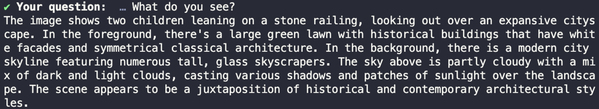

# BAB 14: BERINTERAKSI DENGAN GAMBAR MENGGUNAKAN PESAN MULTIMODAL

Sekarang kita bisa berinteraksi dengan berbagai jenis dokumen dan mengobrol dengan video YouTube, mari lanjutkan dengan membuat AI memahami gambar.

## Memahami Pesan Multimodal

Pesan multimodal adalah pesan yang menggunakan lebih dari satu mode komunikasi untuk berkomunikasi.

Mode komunikasi yang dikenal manusia adalah:

▪ Teks
▪ Video
▪ Audio
▪ Gambar

Model canggih seperti GPT-4 dan Gemini Pro sudah memiliki kemampuan vision, artinya model dapat "melihat" gambar dan menjawab pertanyaan tentangnya.

Menggunakan pesan multimodal, kita dapat menggunakan AI untuk berinteraksi dengan gambar, seperti menanyakan berapa banyak orang yang ditampilkan pada gambar atau warna apa yang dominan dalam gambar.

Mari pelajari cara membuat aplikasi seperti itu menggunakan LangChain selanjutnya.

## Mengirim Pesan Multimodal di LangChain

Untuk mengirim pesan multimodal di LangChain, Anda hanya perlu menyesuaikan template prompt dan meneruskan daftar untuk pesan manusia.

Pertama, buat file baru bernama handle_image.js, impor paket yang diperlukan, dan definisikan LLM yang akan digunakan sebagai berikut:

```javascript
import { ChatOpenAI } from "@langchain/openai"

import { ChatPromptTemplate } from "@langchain/core/prompts"

import { readFile } from "node:fs/promises"
import prompts from "prompts"

import "dotenv/config"

const llm = new ChatOpenAI({
  model: "gpt-4o",
  apiKey: process.env.OPENAI_KEY,
})
```

Modul `readFile` dari Node digunakan untuk membaca file gambar dan mengkodekannya dalam format string base64.

Tulis fungsi untuk mengenkode gambar di bawah variabel `llm`:

```javascript
const encodeImage = async (imagePath) => {
  const imageData = await readFile(imagePath)
  return imageData.toString("base64")
}

const image = await encodeImage("./image.jpg")
```

Ubah `'./image.jpg'` yang diteruskan ke fungsi `encodeImage()` dengan gambar yang Anda miliki di komputer Anda.

Anda dapat meneruskan gambar apa pun yang Anda miliki di komputer ke fungsi tersebut, tetapi pastikan tidak mengandung data sensitif.

Gambar yang dienkode kemudian dapat diteruskan ke template chat prompt sebagai berikut:

```javascript
const prompt = ChatPromptTemplate.fromMessages([
  ["system", "Anda adalah asisten yang membantu yang dapat mendeskripsikan gambar secara detail."],
  [
    "human",
    [
      { type: "text", text: "{input}" },
      {
        type: "image_url",
        image_url: {
          url: `data:image/jpeg;base64,${image}`,
          detail: "low",
        },
      },
    ],
  ],
])
```

Dalam template di atas, Anda dapat melihat bahwa ada dua pesan yang diteruskan sebagai pesan manusia: `"text"` untuk pertanyaan dan `"image_url"` untuk gambar.

Kita dapat meneruskan URL gambar publik seperti `'https://'`, tetapi di sini kami menggunakan URI `data:image` karena kami mengunggah gambar dari komputer kami.

Di belakang layar, LangChain secara otomatis mengubah pesan menjadi pesan multimodal.

Buat rantai dari prompt dan llm, dan minta input dari pengguna:

```javascript
const chain = prompt.pipe(llm)
const response = await chain.invoke({ input: "Apa yang Anda lihat pada gambar ini?" })

console.log(response.content)
```

LLM akan memproses gambar, kemudian memberikan jawaban yang sesuai.

## Menambahkan Riwayat Obrolan

Sekarang Anda dapat mengajukan pertanyaan tentang gambar menggunakan model bahasa, mari tingkatkan aplikasi dengan menambahkan riwayat obrolan.

Seperti biasa, impor paket yang diperlukan untuk menambahkan antarmuka web dan riwayat terlebih dahulu:

```javascript
import { ChatOpenAI } from "@langchain/openai"

import { ChatMessageHistory } from "langchain/memory"
import { RunnableWithMessageHistory } from "@langchain/core/runnables"
import { ChatPromptTemplate, MessagesPlaceholder } from "@langchain/core/prompts"

import { readFile } from "node:fs/promises"

import prompts from "prompts"

import "dotenv/config"
```

Selanjutnya, Anda perlu membuat instance kelas ChatMessageHistory dan meningkatkan rantai untuk menyertakan riwayat obrolan, mirip dengan Bab 9.

```javascript
const history = new ChatMessageHistory()

const chain = prompt.pipe(llm)

const chainWithHistory = new RunnableWithMessageHistory({
  runnable: chain,
  getMessageHistory: (sessionId) => history,
  inputMessagesKey: "input",
  historyMessagesKey: "chat_history",
})
```

Langkah berikutnya adalah meminta pertanyaan dari pengguna. Gunakan prompts untuk melakukannya:

```javascript
console.log("Obrolan Dengan Gambar")
console.log("Ketik /bye untuk menghentikan program")

let exit = false
while (!exit) {
  const { question } = await prompts([
    {
      type: "text",
      name: "question",
      message: "Pertanyaan Anda: ",
      validate: (value) => (value ? true : "Pertanyaan tidak boleh kosong"),
    },
  ])
  if (question == "/bye") {
    console.log("Sampai jumpa!")
    exit = true
  } else {
    const response = await chainWithHistory.invoke(
      { input: question },
      {
        configurable: {
          sessionId: "test",
        },
      }
    )
    console.log(response.content)
  }
}
```

Dan itu saja. Sekarang Anda dapat mengajukan pertanyaan tentang gambar yang Anda berikan ke fungsi `encodeImage()`.

Saya menggunakan gambar dari `https://g.codewithnathan.com/lc-image` untuk contoh di bawah ini:

Gambar 39. Hasil Obrolan Dengan Gambar

Coba tanyakan detail tertentu, seperti berapa banyak orang yang dapat Anda lihat pada gambar, atau warna apa yang dominan pada gambar.

## Pesan Multimodal Ollama

Jika Anda ingin mengirim pesan multimodal ke Ollama, Anda perlu mengunduh model yang mendukung format pesan, seperti `bakllava` dan `llava`.

Anda dapat menjalankan perintah `ollama pull bakllava` untuk mengunduh model ke mesin Anda. Perhatikan bahwa kedua model membutuhkan RAM 8GB untuk berjalan tanpa masalah.

Untuk mengirim pesan multimodal ke Ollama, Anda perlu memastikan bahwa kunci `image_url` memiliki nilai string sebagai berikut:



```javascript
['human',
  [
    { type: 'text', text: '{input}' },
    {
      type: 'image_url',
      image_url: `data:image/jpeg;base64,${image}`,
    },
  ],
],
```

Tetapi sekali lagi, ada bug di sisi LangChain yang mengubah kunci `image_url` menjadi objek dan menambahkan properti url di objek tersebut.

Untuk mengatasi masalah ini, Anda perlu membuka sumber `ollama.js` pada kode `node_modules/@langchain/community/dist/chat_models` dan mengubah kode di baris `468` sebagai berikut:

ditemukan

```javascript
else if (contentPart.type === "image_url") {
  console.log(contentPart.image_url);
  const imageUrlComponents = contentPart.image_url.split(",");
  // Mendukung format data:image/jpeg;base64,<image> juga
  images.push(imageUrlComponents[1] ?? imageUrlComponents[0]);
}
```

`console.log()` di atas akan mencetak isi kunci `image_url`, yang terlihat seperti ini:

```javascript
{
  url: "..."
}
```

Seperti yang Anda lihat, itu diubah menjadi objek oleh LangChain meskipun kami meneruskan string.

Ini membuat kode `ollama.js` asli yang memeriksa tipe string selalu menyebabkan kesalahan:

```javascript
else if (
  contentPart.type === "image_url" &&
  typeof contentPart.image_url === "string"
) {
  const imageUrlComponents = contentPart.image_url.split(",");
  // Mendukung format data:image/jpeg;base64,<image> juga
  images.push(imageUrlComponents[1] ?? imageUrlComponents[0]);
} else {
  throw new Error(
    `Tipe konten pesan tidak didukung. Harus memiliki tipe "text" atau tipe
"image_url" dengan bidang "image_url" bertipe string.`
  );
}
```

Saya akan memperbarui bagian ini setelah masalah diselesaikan oleh pengelola LangChain.

## Ringkasan

Kode untuk bab ini tersedia di folder `14_Handling_Images` dari kode sumber buku.

Dalam bab ini, Anda telah belajar cara mengirim pesan multimodal ke model bahasa menggunakan LangChain.

Perhatikan bahwa tidak semua model dapat memahami pesan multimodal. Jika Anda menggunakan Ollama, Anda perlu menggunakan model seperti bakllava dan bukan mistral atau gemma.

Jika LLM tidak memahami, biasanya akan memberi tahu Anda bahwa tidak dapat memahami pesan yang Anda kirim.
