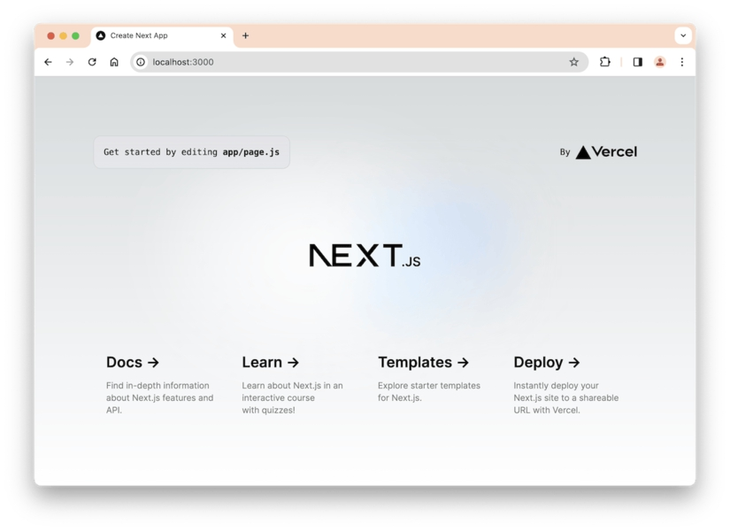
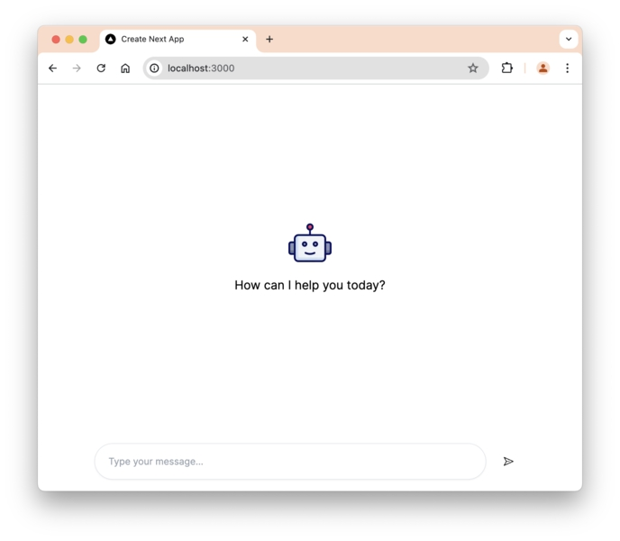
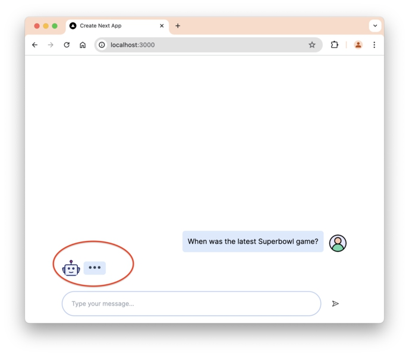
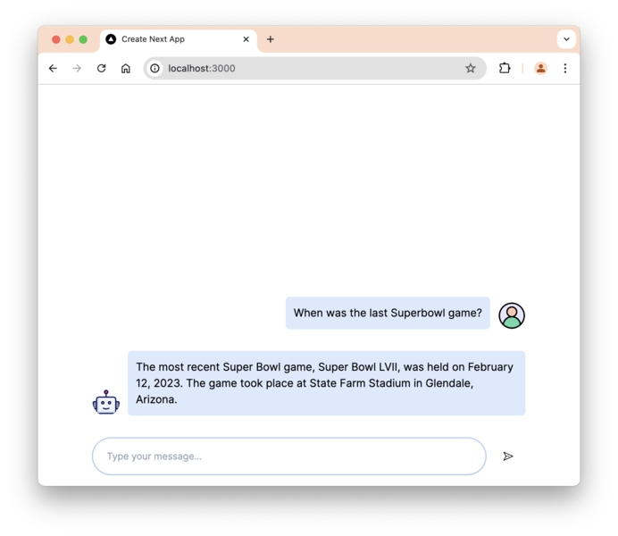
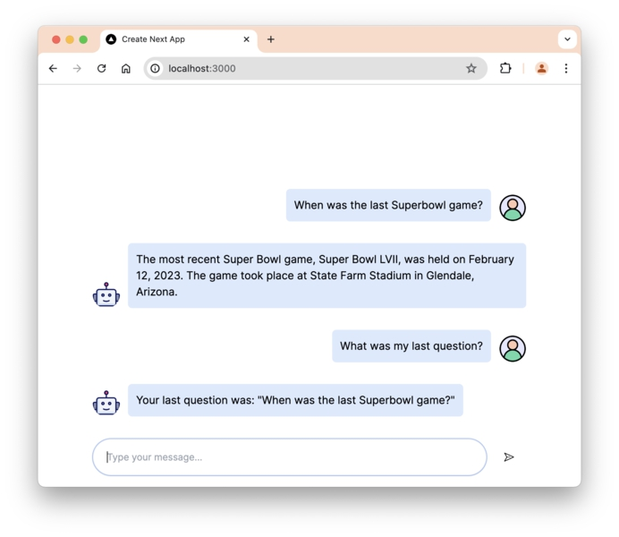

# BAB 15: MENGEMBANGKAN APLIKASI NEXT.JS BERDAYA AI

Setelah kita menjelajahi konsep inti LangChain, mari pelajari cara mengintegrasikan LangChain ke dalam aplikasi web Next.js selanjutnya.

Next.js adalah framework JavaScript dan React yang memungkinkan Anda mengembangkan aplikasi web yang berfungsi penuh.

Jangan khawatir jika Anda belum pernah menggunakan Next.js sebelumnya. Saya akan memandu Anda untuk membuat aplikasi dan menjelaskan kode yang ditulis.

Jika Anda ingin mempelajari dasar-dasar Next.js secara mendalam, Anda bisa mendapatkan buku Beginning Next.js Development saya di `https://codewithnathan.com/beginning-nextjs`

Mari kita mulai!

## Membuat Aplikasi Next.js

Untuk membuat aplikasi Next.js, Anda perlu menjalankan paket `create-next-app` menggunakan `npx`.

Pada saat penulisan ini, versi terbaru Next.js adalah 14.2.4, dan memiliki masalah build dengan LangChain yang masih belum terselesaikan.

Untuk menghindari masalah tersebut, mari gunakan Next.js versi 14.1. Jalankan perintah berikut dari terminal:

```
npx create-next-app@14.1.0 nextjs-langchain
```

Perintah `npx` memungkinkan Anda menjalankan paket Javascript langsung dari terminal.

Anda akan melihat npm meminta untuk menginstal paket baru seperti di bawah ini. Lanjutkan dengan mengetik 'y' dan tekan Enter:

```
Need to install the following packages:
  create-next-app@14.1.0
Ok to proceed? (y) y
```

Setelah `create-next-app` terinstal, program akan menanyakan detail proyek Next.js Anda, seperti apakah Anda ingin menggunakan TypeScript dan Tailwind CSS.

Untuk mengubah opsi, tekan kiri atau kanan untuk memilih Ya atau Tidak, lalu tekan Enter untuk mengonfirmasi pilihan Anda. Anda dapat mengikuti pengaturan default dari `create-next-app` seperti yang ditunjukkan di bawah ini:

```
npx create-next-app@14.1.0 nextjs-langchain
Need to install the following packages:
  create-next-app@14.1.0
Ok to proceed? (y) y
✔ Would you like to use TypeScript? … Yes
✔ Would you like to use ESLint? … Yes
✔ Would you like to use Tailwind CSS? … Yes
✔ Would you like to use `src/` directory? … No
✔ Would you like to use App Router? (recommended) … Yes
✔ Would you like to customize the default import alias (@/*)? … No
```

Paket kemudian menghasilkan proyek baru bernama 'nextjs-langchain' sebagai berikut:

```
Success! Created nextjs-langchain at ...
```

Langkah selanjutnya adalah menggunakan perintah cd untuk mengubah direktori kerja ke aplikasi yang baru kita buat, lalu jalankan npm run dev untuk memulai aplikasi:

```
cd nextjs-langchain
npm run dev

> next-events@0.1.0 dev
> next dev

    ▲ Next.js 14.1.0
    - Local:        http://localhost:3000

    ✓ Ready in 1156ms
```

Sekarang Anda dapat melihat aplikasi yang berjalan dari browser, di alamat localhost yang ditentukan:

Jika Anda melihat layar di atas, itu berarti Anda telah berhasil membuat dan menjalankan aplikasi Next.js pertama Anda. Kerja bagus!

## Menginstal Paket yang Diperlukan

Hentikan aplikasi yang sedang berjalan dengan CTRL + C, lalu instal paket yang akan kita gunakan:

```
npm install langchain @langchain/openai
```

Paket langchain dan @langchain/openai adalah paket yang sama yang kita gunakan di bab sebelumnya.

Selanjutnya, instal paket yang diperlukan untuk membuat komponen React front-end:



```
npm install @radix-ui/react-icons react-textarea-autosize react-code-blocks marked
```

Dengan paket terinstal, mari buat server action yang akan menginstruksikan LangChain untuk memanggil LLM selanjutnya.

## Menambahkan Server Action

Server Actions adalah fitur baru yang ditambahkan di Next.js 14 sebagai cara standar baru untuk mengambil dan memproses data dalam aplikasi Next.js.

Server action pada dasarnya adalah fungsi asinkron yang dieksekusi di server. Anda dapat memanggil fungsi dari komponen React.

Di folder proyek Anda, buat folder baru bernama actions/, lalu buat file bernama openai.action.ts sebagai berikut:

```
.
├── actions
│    └── openai.action.ts
└── app
```

Di dalam file ini, impor modul langchain dan buat chain yang akan digunakan untuk berkomunikasi dengan LLM:

```javascript
"use server"

import { ChatOpenAI } from "@langchain/openai"
import { ChatPromptTemplate } from "@langchain/core/prompts"

const llm = new ChatOpenAI({
  model: "gpt-4o",
  apiKey: process.env.OPENAI_KEY,
})

const prompt = ChatPromptTemplate.fromMessages([
  ["system", "You are an AI chatbot having a conversation with a human. Use the following context to understand the human question. Do not include emojis in your answer"],
  ["human", "{input}"],
])

const chain = prompt.pipe(llm)
```

Direktif `'use server'` ditambahkan di bagian atas file untuk memberi tahu Next.js bahwa file ini hanya dapat dijalankan di server.

Anda tidak perlu dotenv untuk memuat variabel lingkungan dalam aplikasi Next.js.

Setelah itu, buat fungsi asinkron bernama `getReply()` yang menerima parameter string dan memanggil metode `chain.invoke()` sebagai berikut:

```javascript
export const getReply = async (message: string) => {
  const response = await chain.invoke({
    input: message,
  })

  return response.content
}
```

Dengan cara ini, Anda dapat memanggil fungsi `getReply()` kapan pun Anda ingin mengirim pesan ke LLM.

Selanjutnya, kita akan membuat komponen untuk antarmuka chat.

## Menambahkan Foto Profil untuk Pengguna dan Asisten

Sebelum membuat antarmuka, mari tambahkan dua gambar yang akan digunakan sebagai foto profil.

Anda bisa mendapatkan file `'user.png'` dan `'robot.png'` dari kode sumber, dan menempatkannya di folder `public/`.

Juga, hapus file next.svg dan vercel.svg karena kita tidak membutuhkannya lagi.

## Mengembangkan Komponen Chat React

Antarmuka chat akan dibuat menggunakan React. Pertama, buat folder bernama `components/`, lalu buat folder lain bernama `chat/` di dalamnya.

Di dalam folder chat/, buat file bernama index.tsx dan impor paket yang diperlukan oleh file ini:

```javascript
"use client"

import { useState } from "react"
import ChatList from "./chat-list"
import ChatBottombar from "./chat-bottombar"
import { getReply } from "@/actions/openai.action"
```

Ketika Anda menggunakan fungsionalitas React seperti `useState`, Anda perlu mendefinisikan direktif `'use client'` di bagian atas file untuk memberi tahu Next.js bahwa komponen ini harus dirender di browser.

`ChatList` dan `ChatBottombar` adalah bagian dari antarmuka chat yang akan kita buat nanti.

Selanjutnya, Anda perlu mendefinisikan antarmuka untuk objek `Message` sebagai berikut:

```TypeScript
export interface Message {
  role: string;
  content: string;
}
```

Antarmuka ini digunakan untuk mengetik objek Message, yang akan menyimpan pesan di front-end.

Selanjutnya, buat komponen fungsi `Chat()` sebagai berikut:

```tsx
export default function Chat() {
  const [loadingSubmit, setLoadingSubmit] = useState(false)
  const [messages, setMessages] = useState<Message[]>([])

  const sendMessage = async (newMessage: Message) => {
    setLoadingSubmit(true)
    setMessages((prevMessages) => [...prevMessages, newMessage])

    const response = await getReply(newMessage.content)

    const reply: Message = {
      role: "assistant",
      content: response as string,
    }
    setLoadingSubmit(false)
    setMessages((prevMessages) => [...prevMessages, reply])
  }

  return (
    <div className="max-w-2xl flex flex-col justify-between w-full h-full">
      <ChatList messages={messages} loadingSubmit={loadingSubmit} />
      <ChatBottombar sendMessage={sendMessage} />
    </div>
  )
}
```

Komponen `Chat()` berisi fungsi `sendMessage()`, yang digunakan untuk mengirim pesan pengguna ke server action.

Ada dua state yang didefinisikan dalam komponen ini. State `loadingSubmit` akan menampilkan animasi loading saat LLM sedang menghasilkan balasan.

State messages akan menampung pesan percakapan, yang ditampilkan oleh komponen `ChatList`.

Selanjutnya, Anda perlu membuat komponen `ChatList`, jadi buat file baru bernama `chat-list.tsx` dengan konten berikut:

```tsx
import { useRef, useEffect } from "react"
import Image from "next/image"
import { marked } from "marked"
import { Message } from "./"

interface ChatListProps {
  messages: Message[]
  loadingSubmit: boolean
}

export default function ChatList({ messages, loadingSubmit }: ChatListProps) {
  const bottomRef = useRef<HTMLDivElement>(null)

  const scrollToBottom = () => {
    bottomRef.current?.scrollIntoView({ behavior: "smooth", block: "end" })
  }

  useEffect(() => {
    scrollToBottom()
  }, [messages])
}
```

Komponen `ChatList` akan menampilkan pesan di browser.

Fungsi `scrollToBottom()` digunakan untuk secara otomatis menggulir ke bawah daftar chat. Fungsi ini dipanggil setiap kali nilai variabel messages diperbarui karena `useEffect()`.

Di bawah panggilan `useEffect()`, buat pernyataan if untuk memeriksa panjang array messages:

```tsx
if (messages.length === 0) {
  return (
    <div className="w-full h-full flex justify-center items-center">
      <div className="flex flex-col gap-4 items-center">
        <Image src="/robot.png" alt="AI" width={64} height={64} className="object-contain" />
        <p className="text-center text-lg text-muted-foreground">How can I help you today?</p>
      </div>
    </div>
  )
}
```

Ketika panjang array messages adalah nol, sebuah Gambar dan teks akan ditampilkan kepada pengguna seperti ini:


Tepat di bawah pernyataan if, tulis pernyataan return lain untuk menampilkan pesan yang ada:

```tsx
return (
  <div className="w-full overflow-x-hidden h-full justify-end">
    <div
      className="w-full flex flex-col overflow-x-hidden overflow-y-hidden
min-h-full justify-end"
    >
      {messages.map((message, index) => (
        <div key={index} className={`flex flex-col gap-2 p-4 ${message.role === "user" ? "items-end" : "items-start"}`}>
          <div className="flex gap-3 items-center">
            {message.role === "user" && (
              <div className="flex items-end gap-3">
                <span
                  className="bg-blue-100 p-3 rounded-md max-w-xs sm:max-w-2xl
overflow-x-auto"
                  dangerouslySetInnerHTML={{
                    __html: marked.parse(message.content),
                  }}
                />
                <span
                  className="relative h-10 w-10 shrink-0 rounded-full flex
justify-start items-center overflow-hidden"
                >
                  <Image className="aspect-square h-full w-full object-contain" alt="user" width="32" height="32" src="/user.png" />
                </span>
              </div>
            )}
            {message.role === "assistant" && (
              <div className="flex items-end gap-3">
                <span
                  className="relative h-10 w-10 shrink-0 overflow-hidden
rounded-full flex justify-start items-center"
                >
                  <Image className="aspect-square h-full w-full object-contain" alt="AI" width="32" height="32" src="/robot.png" />
                </span>
                <span
                  className="bg-blue-100 p-3 rounded-md max-w-xs sm:max-w-2xl
overflow-x-auto"
                >
                  <span
                    key={index}
                    dangerouslySetInnerHTML={{
                      __html: marked.parse(message.content),
                    }}
                  />
                </span>
              </div>
            )}
          </div>
        </div>
      ))}
      {loadingSubmit && (
        <div className="flex pl-4 pb-4 gap-2 items-center">
          <span
            className="relative h-10 w-10 shrink-0 rounded-full bg-slate-700 motion-
safe:animate-[bounce_1s_ease-in-out_infinite]"
          ></span>
          <span
            className="size-1.5 rounded-full bg-slate-700 motion-
safe:animate-[bounce_0.5s_ease-in-out_infinite]"
          ></span>
        </div>
      )}
    </div>
    <div id="anchor" ref={bottomRef}></div>
  </div>
)
```

Ketika properti role adalah 'user', bubble chat pengguna akan ditampilkan di ujung kanan. Jika tidak, kita tunjukkan bubble asisten AI di ujung kiri.

Ketika state loadingSubmit true, kita tunjukkan animasi berpikir:

Itu semua untuk komponen `ChatList`.

Selanjutnya, buat file baru bernama `chat-bottombar.tsx` yang berisi satu bilah input chat:



```tsx
import { useState } from "react"
import TextareaAutosize from "react-textarea-autosize"
import { PaperPlaneIcon } from "@radix-ui/react-icons"
import { Message } from "./"

interface ChatBottombarProps {
  sendMessage: (newMessage: Message) => void
}
export default function ChatBottombar({ sendMessage }: ChatBottombarProps) {
  const [input, setInput] = useState("")

  const handleKeyDown = (e: React.KeyboardEvent<HTMLTextAreaElement>) => {
    if (e.key === "Enter" && !e.shiftKey) {
      e.preventDefault()
      sendMessage({ role: "user", content: input })
      setInput("")
    }
  }

  return (
    <div className="p-4 flex justify-between w-full items-center gap-2">
      <form className="w-full items-center flex relative gap-2">
        <TextareaAutosize
          autoComplete="off"
          value={input}
          onChange={(e) => setInput(e.target.value)}
          onKeyDown={handleKeyDown}
          placeholder="Type your message..."
          className="border-input max-h-20 px-5 py-4 text-sm shadow-sm
placeholder:text-muted-foreground focus-visible:outline-none focus-
visible:ring-1 focus-visible:ring-ring disabled:cursor-not-allowed
disabled:opacity-50 w-full border rounded-full flex items-center h-14 resize-
none overflow-hidden"
        />
        <button
          className="inline-flex items-center justify-center whitespace-nowrap
rounded-md text-sm font-medium transition-colors focus-visible:outline-none
focus-visible:ring-1 focus-visible:ring-ring disabled:pointer-events-none
disabled:opacity-50 hover:bg-accent hover:text-accent-foreground h-14 w-14"
          type="submit"
        >
          <PaperPlaneIcon />
        </button>
      </form>
    </div>
  )
}
```

Komponen ini hanya menampung elemen `<form>` dengan `<input>` dan `<button>`.

Ketika Anda mengirim pesan, fungsi `sendMessage()` yang diteruskan oleh komponen Chat akan dieksekusi, dan LangChain akan mengirim permintaan ke LLM.

Baik, sekarang komponen antarmuka chat selesai.

Anda dapat mengimpor komponen dari `app/page.tsx` sebagai berikut:

```tsx
import Chat from "@/components/chat"

export default function Home() {
  return (
    <main className="flex h-[calc(100dvh)] flex-col items-center ">
      <Chat />
    </main>
  )
}
```

Juga, hapus gaya CSS yang ditentukan di globals.css kecuali direktif Tailwind:

```css
@tailwind base;
@tailwind components;
@tailwind utilities;

/* Remove the rest... */
```

Sekarang jalankan aplikasi menggunakan npm run dev, dan coba ngobrol dengan LLM dari browser:

Tugas selanjutnya adalah menambahkan riwayat chat.

## Menambahkan Riwayat Chat

Riwayat chat dapat ditambahkan ke server action yang telah kita buat sebelumnya.

Impor ChatMessageHistory untuk menyimpan riwayat di memori dan RunnableWithMessageHistory untuk membuat chain dengan riwayat:



```tsx
// openai.action.ts
import { ChatMessageHistory } from 'langchain/memory';
import { RunnableWithMessageHistory } from '@langchain/core/runnables';
import {
  ChatPromptTemplate,
  MessagesPlaceholder,
} from '@langchain/core/prompts';

// ... other code

const history = new ChatMessageHistory();

const prompt = ChatPromptTemplate.fromMessages([
  ['system',
    'You are an AI chatbot having a conversation with a human. Use the
following context to understand the human question. Do not include emojis in
your answer',
  ],
  new MessagesPlaceholder('chat_history'),
  ['human', '{input}'],
]);

const chain = prompt.pipe(llm);

const chainWithHistory = new RunnableWithMessageHistory({
  runnable: chain,
  getMessageHistory: sessionId => history,
  inputMessagesKey: 'input',
  historyMessagesKey: 'chat_history',
});
```

Setelah membuat objek `chainWithHistory`, Anda perlu memperbarui chain yang dipanggil dalam fungsi `getReply()`:

```tsx
export const getReply = async (message: string) => {
  const response = await chainWithHistory.invoke(
    {
      input: message,
    },
    {
      configurable: {
        sessionId: "test",
      },
    }
  )

  return response.content
}
```

Sekarang pesan chat sebelumnya akan ditambahkan ke prompt.

Anda dapat mencoba mengajukan pertanyaan terlebih dahulu, lalu menanyakan pertanyaan terakhir yang Anda ajukan seperti yang ditunjukkan di bawah ini:

Sekarang aplikasi terlihat seperti versi ChatGPT yang lebih sederhana. Sangat bagus!

## Ringkasan

Kode untuk bab ini tersedia di folder `15_nextjs_langchain` dalam kode sumber buku.

Dalam bab ini, Anda telah berhasil mengintegrasikan LangChain ke dalam aplikasi Next.js.

Seperti yang Anda lihat, mengembangkan aplikasi yang didukung AI tidak jauh berbeda dengan mengembangkan aplikasi web biasa.

Saat menggunakan Next.js, Anda dapat membuat antarmuka menggunakan komponen React, lalu menentukan server actions yang menggunakan library LangChain untuk memanggil LLM.

Ketika Anda menerima respons, Anda dapat menyimpan respons dalam state, lalu menampilkannya kepada pengguna dari sana.



Dalam bab ini, Anda telah berhasil mengintegrasikan LangChain ke dalam aplikasi Next.js.

Seperti yang Anda lihat, mengembangkan aplikasi yang didukung AI tidak jauh berbeda dengan mengembangkan aplikasi web biasa.

Saat menggunakan Next.js, Anda dapat membuat antarmuka menggunakan komponen React, lalu menentukan server actions yang menggunakan library LangChain untuk memanggil LLM.

Ketika Anda menerima respons, Anda dapat menyimpan respons dalam state, lalu menampilkannya kepada pengguna dari sana.
