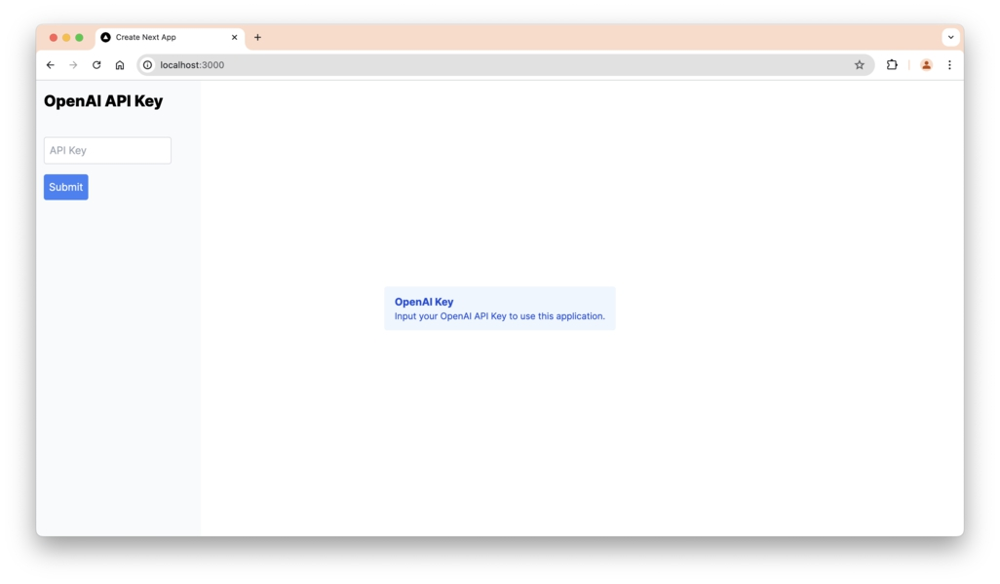
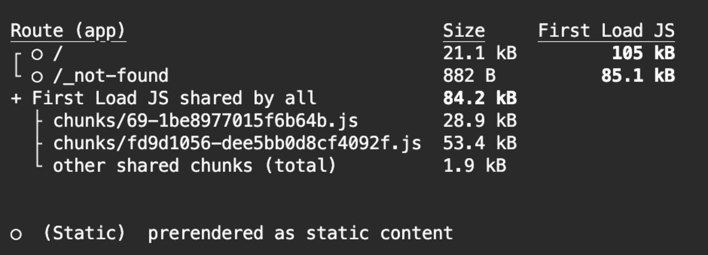
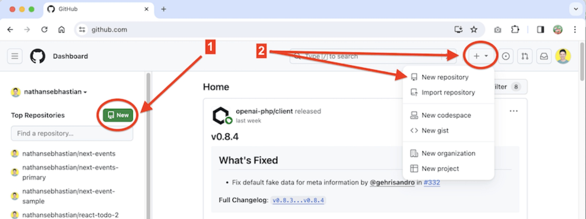
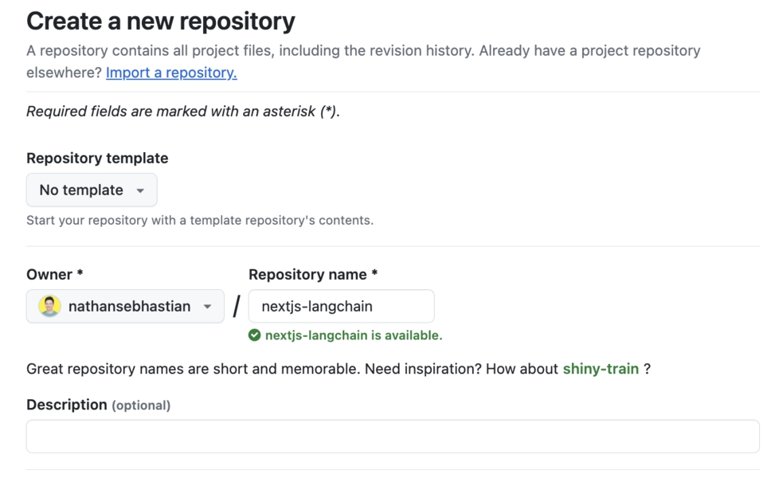
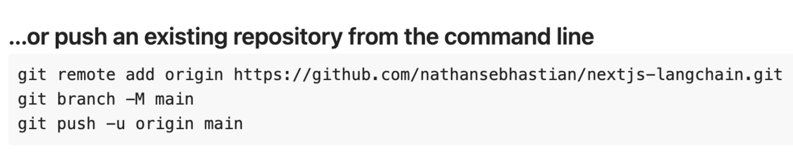
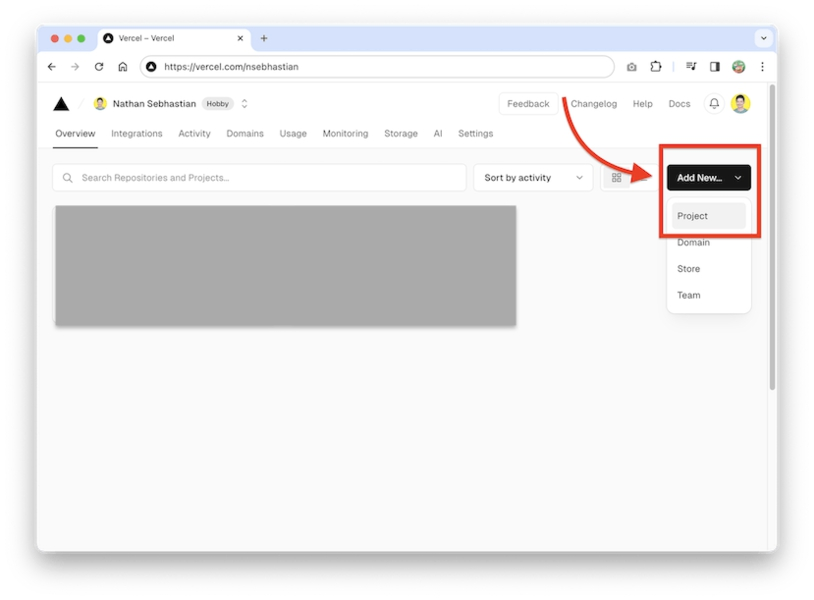
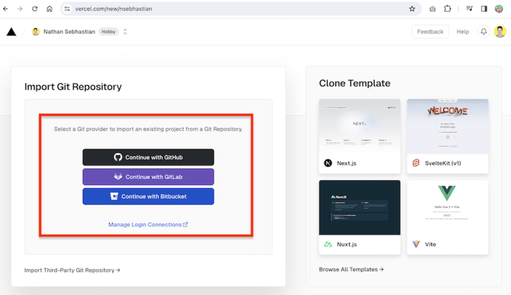
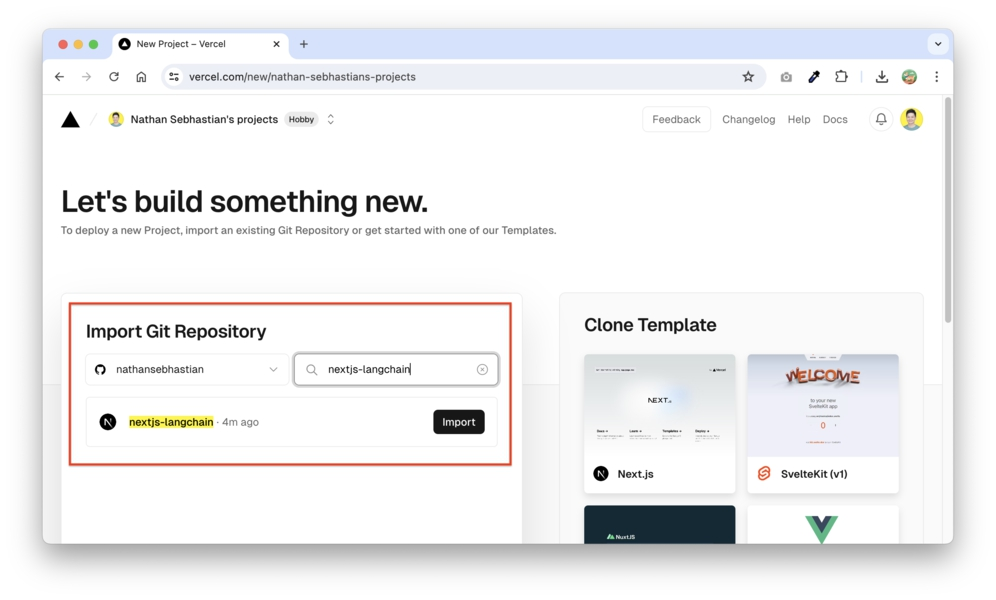
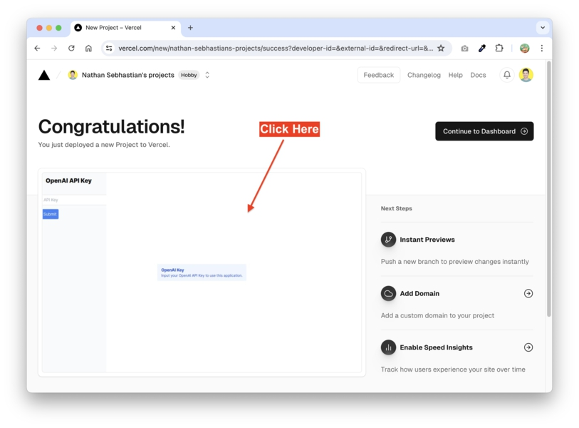

# BAB 16: MENYEBARLUASKAN APLIKASI AI NEXT.JS KE PRODUKSI

Sekarang aplikasi Next.js sudah berjalan, kita akan melakukan beberapa perbaikan agar aplikasi dapat disebarluaskan ke produksi.

Kita perlu meningkatkan pengalaman pengguna agar aplikasi terasa lebih interaktif, lalu meminta kunci API dari pengguna untuk menggunakan aplikasi.

## Streaming Respons

Sejauh ini, respons dari LLM ditampilkan sekaligus setelah LLM selesai menghasilkan jawaban. Penundaan ini membuat pengalaman pengguna kurang interaktif.

Untuk meningkatkan pengalaman pengguna, kita dapat melakukan streaming respons saat LLM sedang menghasilkan respons. Dengan cara ini, pengguna akan melihat output secara bertahap, membuat interaksi terasa lebih dinamis dan responsif.

Dari terminal, jalankan npm install ai sebagai berikut:

```
npm install ai
```

Paket ai adalah pustaka yang digunakan untuk mengelola streaming chat dan pembaruan UI. Ini memungkinkan Anda mengembangkan antarmuka berbasis AI yang dinamis dengan lebih efisien.

Sekarang buka file openai.action.ts dan impor fungsi createStreamableValue dari paket ai/rsc:

```typescript
import { createStreamableValue } from "ai/rsc"

export const getReply = async (message: string) => {
  const stream = createStreamableValue()

  ;(async () => {
    const response = await chainWithHistory.stream(
      {
        input: message,
      },
      {
        configurable: {
          sessionId: "test",
        },
      }
    )

    for await (const chunk of response) {
      stream.update(chunk.content)
    }

    stream.done()
  })()

  return { streamData: stream.value }
}
```

Fungsi `createStreamableValue()` digunakan untuk membuat objek yang dapat di-stream. Objek ini dapat diperbarui secara real-time seiring respons yang datang.

Alih-alih metode `invoke()` biasa, kita memanggil metode `stream()` dari chain.

Metode `stream()` mengembalikan iterable, yang diperbarui saat respons di-stream oleh LangChain.

Sintaks `for await…of` digunakan untuk menangani iterasi asinkron atas potongan data yang diterima oleh objek respons.

Ketika respons selesai, metode stream.done() dipanggil untuk menandakan proses streaming selesai, dan stream.value akan dikembalikan.

Proses streaming dibungkus dalam ekspresi fungsi yang langsung dipanggil (IIFE) agar streaming berjalan paralel.

Jika kita menghapus IIFE, streamData akan segera dikembalikan ke front-end sebelum streaming selesai.

Selanjutnya, buka file `chat/index.tsx` dan perbarui fungsi `sendMessage()` untuk membaca nilai yang dapat di-stream sebagai berikut:

```typescript
import { readStreamableValue } from "ai/rsc"

const sendMessage = async (newMessage: Message) => {
  setLoadingSubmit(true)
  setMessages((prevMessages) => [...prevMessages, newMessage])

  const { streamData } = await getReply(newMessage.content)

  const reply: Message = {
    role: "assistant",
    content: "",
  }

  setLoadingSubmit(false)
  setMessages((prevMessages) => [...prevMessages, reply])

  for await (const stream of readStreamableValue(streamData)) {
    reply.content = `${reply.content}${stream}`
    setMessages((prevMessages) => {
      return [...prevMessages.slice(0, -1), reply]
    })
  }
}
```

Di sini, kita mengubah nama variabel respons menjadi `streamValue`, lalu kita inisialisasi objek balasan dengan properti content kosong.

Saat kita menerima respons, panggil `setLoadingSubmit(false)` untuk menghentikan indikator pemikiran, lalu atur balasan sebagai pesan terbaru.

Setelah itu, buat loop for await…of lainnya untuk membaca nilai yang dapat di-stream dan meneruskannya sebagai nilai reply.content.

Pesan terbaru ditimpa terus-menerus oleh objek balasan menggunakan fungsi `setMessages()`.

Sekarang ketika Anda mengirim pesan ke LLM, respons akan memiliki animasi ketikan.

## Membuat Input Kunci API

Aplikasi Next.js ini menggunakan kunci API kita untuk mengakses API penyedia LLM.

Ini tidak disarankan untuk produksi karena kita akan dikenakan biaya setiap kali pengguna menggunakan aplikasi.

Alih-alih menyediakan kunci API kita, mari izinkan pengguna menambahkan kunci API mereka sendiri ke aplikasi.

Untuk melakukannya, kita perlu membuat input teks di sidebar untuk kunci API, dan menjalankan proses untuk membuat instance LLM di server hanya ketika kunci API ini ditambahkan.

Kita akan menambahkan aksi server untuk memproses kunci API terlebih dahulu.

Menambahkan Fungsi `setApi()`

Kembali ke file `openai.action.ts`, Anda perlu membungkus instansiasi llm dan `chainWithHistory` dalam sebuah fungsi.

Fungsi `setApi()` di bawah menerima string apiKey yang akan digunakan untuk membuat instance objek llm:

```typescript
let chainWithHistory: RunnableWithMessageHistory<any, AIMessageChunk> | null = null

export const setApi = async (apiKey: string) => {
  const llm = new ChatOpenAI({
    model: "gpt-4o",
    apiKey: apiKey,
  })

  const history = new ChatMessageHistory()

  const prompt = ChatPromptTemplate.fromMessages([
    ["system", "You are an AI chatbot having a conversation with a human. Use the following context to understand the human question. Do not include emojis in your answer"],
    new MessagesPlaceholder("chat_history"),
    ["human", "{input}"],
  ])

  const chain = prompt.pipe(llm)

  chainWithHistory = new RunnableWithMessageHistory({
    runnable: chain,
    getMessageHistory: (sessionId) => history,
    inputMessagesKey: "input",
    historyMessagesKey: "chat_history",
  })
}
```

Di sini, kita inisialisasi variabel chainWithHistory sebagai null. Variabel ini akan menahan instance RunnableWithMessageHistory ketika fungsi setApi() dieksekusi.

Sekarang chainWithHistory mungkin berisi nilai null, kita perlu menegaskan tipe chainWithHistory dalam fungsi getReply() sebagai berikut:

```typescript
import { AIMessageChunk } from "@langchain/core/messages"

// inside getReply():
;async () => {
  const response = await (chainWithHistory as RunnableWithMessageHistory<any, AIMessageChunk>)
    .stream
    // ...
    ()
}
```

Penegasan tipe `as` memberi tahu TypeScript bahwa kita yakin variabel `chainWithHistory` bukan null ketika fungsi ini dieksekusi.

## Menambahkan Sidebar Chat

Sekarang kita memiliki fungsi `setApi()`, kita perlu membuat sidebar tempat pengguna dapat memasukkan kunci API mereka untuk menggunakan aplikasi.

Buat file baru bernama `chat-sidebar.tsx` dan tulis kode berikut:

```tsx
"use client"

import { useState } from "react"

interface ChatSidebarProps {
  handleSubmitKey: (apiKey: string) => void
}

export default function ChatSidebar({ handleSubmitKey }: ChatSidebarProps) {
  const [keyInput, setKeyInput] = useState("")

  const submitForm = (e: React.FormEvent<HTMLFormElement>) => {
    e.preventDefault()
    handleSubmitKey(keyInput)
  }

  return (
    <aside
      className="fixed top-0 left-0 z-40 w-64 h-screen -translate-x-full
translate-x-0"
    >
      <div className="h-full px-3 py-4 overflow-y-auto bg-slate-50">
        <h1 className="mb-4 text-2xl font-extrabold">OpenAI API Key</h1>
        <div
          className="w-full flex py-6 items-center justify-between
lg:justify-center"
        >
          <form className="space-y-4" onSubmit={submitForm}>
            <input
              type="password"
              placeholder="API Key"
              className="border border-gray-300 p-2 rounded focus:outline-none
focus:ring-2 focus:ring-blue-500"
              value={keyInput}
              onChange={(e) => setKeyInput(e.target.value)}
            />
            <button
              type="submit"
              className="bg-blue-500 text-white p-2 rounded hover:bg-blue-600
focus:outline-none focus:ring-2 focus:ring-blue-500"
            >
              Submit
            </button>
          </form>
        </div>
      </div>
    </aside>
  )
}
```

Komponen `ChatSidebar` mirip dengan komponen ChatBottombar karena juga memiliki formulir dengan input dan tombol.

Selanjutnya, buka file `index.tsx` untuk mengimpor komponen dan fungsi `setApi()` dan menggunakannya:

```tsx
import { setApi, getReply } from "@/actions/openai.action"
import ChatSidebar from "./chat-sidebar"

export default function Chat() {
  // ...
  const [apiKey, setApiKey] = useState("")

  // ...

  const handleSubmitKey = async (apiKey: string) => {
    await setApi(apiKey)
    setApiKey(apiKey)
  }

  return (
    <div className="max-w-2xl flex flex-col justify-between w-full h-full  ">
      <ChatSidebar handleSubmitKey={handleSubmitKey} />
      <ChatList apiKey={apiKey} messages={messages} loadingSubmit={loadingSubmit} />
      {apiKey && <ChatBottombar sendMessage={sendMessage} />
    </div>
  )
}
```

Kami juga menambahkan prop apiKey ke komponen ChatList sehingga kami dapat menampilkan peringatan selama kunci API kosong.

Perbarui komponen ChatList sedikit untuk membaca nilai apiKey:

```tsx
useEffect(() => {
  scrollToBottom()
}, [messages])

if (!apiKey) {
  return (
    <div className="w-full h-full flex justify-center items-center">
      <div className="flex flex-col gap-4 items-center">
        <div className="bg-blue-50 text-blue-700 px-4 py-3 rounded" role="alert">
          <p className="font-bold">OpenAI Key</p>
          <p className="text-sm">Input your OpenAI API Key to use this application.</p>
        </div>
      </div>
    </div>
  )
}
```

Ketika kunci API tidak ditambahkan, peringatan ditampilkan sebagai berikut:



Dengan ini, aplikasi sekarang siap untuk disebarluaskan.

## Menjalankan Build Secara Lokal

Langkah selanjutnya adalah menjalankan perintah build dari baris perintah. Jika Anda mendapatkan error saat menjalankan build secara lokal, error yang sama pasti akan terjadi saat menyebarluaskan ke produksi.

Dari folder root proyek Anda, jalankan perintah build Next.js sebagai berikut:

```
npm run build
```

Setelah proses build selesai, Anda akan melihat output seperti ini:

Hasil di atas menunjukkan ukuran aplikasi yang dikompilasi, yang berarti build berhasil.

## Mendorong Kode ke GitHub

Menyebarluaskan aplikasi memerlukan Anda memberikan akses ke file dan folder proyek. GitHub adalah platform yang dapat Anda gunakan



untuk menghosting dan berbagi proyek perangkat lunak Anda.

Pada titik ini, Anda seharusnya sudah memiliki akun GitHub saat mendaftar untuk UploadThing, tetapi jika Anda belum membuatnya, sekarang adalah waktu yang tepat untuk melakukannya.

Kunjungi https://github.com dan daftar untuk akun baru. Dari dashboard, buat repositori baru dengan mengklik + New di sidebar kiri, atau tanda + di sisi kanan bilah navigasi:

Gambar 40. Dua Cara Membuat Repositori di GitHub

Repositori (atau repo) adalah ruang penyimpanan yang digunakan untuk menyimpan file proyek perangkat lunak.

Di halaman Create a Repository, isi detail proyek Anda. Satu-satunya detail yang diperlukan adalah nama repositori.

Saya menamai milik saya sebagai 'nextjs-langchain' seperti yang ditunjukkan di bawah ini:



Anda dapat membuat repositori publik jika Anda ingin proyek ini sebagai bagian dari portofolio Anda, atau Anda dapat membuatnya privat.

Setelah repo baru dibuat, Anda akan diberikan instruksi tentang cara mendorong file Anda ke repositori.

Satu instruksi yang Anda butuhkan adalah mendorong repo yang sudah ada dari baris perintah:

Gambar 41. Cara Mendorong Repo yang Sudah Ada ke GitHub

Sekarang Anda perlu membuat repositori untuk proyek Anda. Buka baris perintah, dan di folder root proyek Anda, jalankan perintah





git init:

```
git init
```

Ini akan mengubah proyek Anda menjadi repositori lokal. Tambahkan semua file proyek ke repo lokal ini dengan menjalankan perintah git add .:

```
git add .
```

Perubahan yang ditambahkan ke repo tidak permanen sampai Anda menjalankan perintah git commit. Commit perubahan seperti yang ditunjukkan di bawah ini:

```
git commit -m 'Application ready for deployment'
```

Opsi -m digunakan untuk menambahkan pesan untuk commit. Biasanya, Anda merangkum perubahan yang di-commit ke repositori sebagai pesan.

Sekarang Anda perlu mendorong repositori yang sudah ada ini ke GitHub. Anda dapat melakukannya dengan mengikuti instruksi GitHub:

```
git remote add origin <URL>
git branch -M main
git push -u origin main
```

Anda mungkin diminta untuk memasukkan nama pengguna dan kata sandi GitHub saat menjalankan perintah git push.

Setelah push selesai, segarkan halaman repo GitHub di browser, dan Anda akan melihat file dan folder proyek Anda di sana:

Gambar 42. Proyek Didorong ke GitHub

Ini berarti aplikasi kita sudah didorong (diunggah) ke repositori remote yang dihosting di GitHub.

## Penyebarluasan Vercel

Langkah terakhir adalah menyebarluaskan aplikasi ini di platform pengembangan. Ada beberapa platform yang dapat Anda gunakan untuk menyebarluaskan aplikasi, seperti Google Cloud Platform, AWS, atau Microsoft Azure.

Tetapi platform pengembangan terbaik untuk menyebarluaskan aplikasi Next.js adalah Vercel.

Vercel adalah perusahaan hosting cloud yang dapat Anda gunakan untuk membangun dan menyebarluaskan aplikasi web ke internet. Ini juga sama


perusahaan yang menciptakan Next.js, jadi menyebarluaskan aplikasi Next di Vercel sangat mudah.

Anda dapat mendaftar untuk akun gratis di https://vercel.com, lalu pilih Create New Project di halaman Dashboard:

Gambar 43. Vercel Create New Project

Selanjutnya, Anda akan diminta untuk memberikan proyek yang ingin Anda bangun dan sebarluaskan.

Karena proyek diunggah ke GitHub, Anda dapat memilih Continue With Github seperti yang ditunjukkan di bawah ini:



Gambar 44. Vercel Import Repository Menu

Setelah Anda memberikan akses ke akun GitHub Anda, pilih proyek yang akan disebarluaskan. Anda dapat menggunakan bilah pencarian untuk menyaring repositori:



Gambar 45. Vercel GitHub Import

Kemudian, Anda akan dibawa ke halaman penyiapan proyek. Klik tombol Deploy dan Vercel akan membangun aplikasi untuk Anda.

Ketika build selesai, Anda akan ditampilkan halaman sukses sebagai berikut:



Gambar 46. Vercel Congratulations! Page

Anda dapat mengklik pratinjau gambar untuk membuka aplikasi Anda. Aplikasi akan diberikan domain .vercel.app gratis. Anda dapat menambahkan domain sendiri dari pengaturan Vercel.

Penyebarluasan selesai. Hore!

## Ringkasan

Kode untuk bab ini tersedia di folder 16_nextjs_langchain_prod dalam kode sumber buku.

Anda telah berhasil menyebarluaskan aplikasi Next.js ke internet. Kerja bagus!



Karena model AI dapat diakses menggunakan protokol HTTP, Anda perlu memastikan bahwa kunci API untuk mengakses model ditambahkan ke aplikasi.

Alih-alih menyediakan kunci API Anda dan menanggung biaya dari menjalankan model, Anda dapat meminta pengguna untuk menyediakan kunci mereka sendiri.
