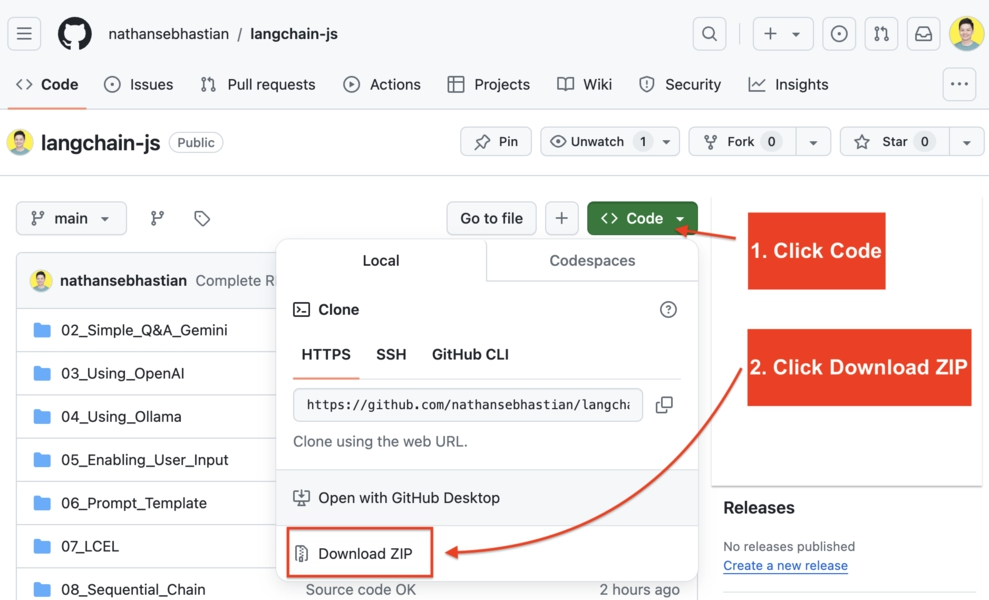

LangChainJS Untuk Pemula

Panduan Langkah-demi-Langkah Pengembangan Aplikasi AI Dengan LangChain, JavaScript/NextJS, OpenAI/ChatGPT dan LLM Lainnya

Oleh Nathan Sebhastian

PRAKATA

Tujuan buku ini adalah memberikan petunjuk langkah-demi-langkah yang mudah untuk membantu Anda mempelajari LangChain.js secara bertahap dari dasar hingga lanjutan.

Anda akan melihat mengapa LangChain adalah alat yang bagus untuk membangun aplikasi AI dan bagaimana ia menyederhanakan integrasi model bahasa ke dalam aplikasi web Anda.

Kita akan melihat bagaimana fitur-fitur penting LangChain seperti template prompt, chains, agents, document loaders, output parsers, dan model classes digunakan untuk membuat aplikasi AI generatif yang cerdas dan fleksibel.

Setelah itu, kita akan mengintegrasikan LangChain ke dalam Next.js sehingga Anda tahu cara membuat aplikasi web berbasis AI.

Bekerja Melalui Buku Ini

Buku ini dibagi menjadi 16 bab yang ringkas, masing-masing fokus pada topik spesifik dalam pemrograman LangChain.

Saya mendorong Anda untuk menulis kode yang Anda lihat di buku ini dan menjalankannya sehingga Anda memiliki gambaran seperti apa pengembangan LangChain. Anda belajar paling baik ketika Anda mengoding bersama dengan contoh-contoh dalam buku ini.

Tips untuk memaksimalkan buku ini: Ambil istirahat setidaknya 10 menit setelah menyelesaikan sebuah bab, sehingga Anda dapat mendapatkan kembali energi dan fokus Anda.

Juga, jangan putus asa jika beberapa konsep sulit dipahami. Mempelajari hal baru apapun sulit untuk pertama kalinya, terutama sesuatu yang teknis seperti pemrograman. Hal terpenting adalah terus berjalan.

Persyaratan

Untuk merasakan manfaat penuh dari buku ini, Anda perlu memiliki pengetahuan dasar JavaScript dan NextJS.

Jika Anda memerlukan bantuan dalam mempelajari JavaScript atau NextJS, Anda dapat mendapatkan salah satu buku saya di https://codewithnathan.com

Kode Sumber

Anda dapat mengunduh kode sumber dari GitHub di tautan berikut:

https://github.com/nathansebhastian/langchain-js

Klik tombol 'Code', lalu klik tautan 'Download ZIP' seperti yang ditunjukkan di bawah:

Gambar 1. Unduh Kode Sumber di GitHub

Anda perlu mengekstrak arsip untuk mengakses kode. Biasanya, Anda cukup mengklik dua kali arsip untuk mengekstrak kontennya.

Angka dalam nama folder menunjukkan nomor bab dalam buku ini.

Kontak

Jika Anda memerlukan bantuan, Anda dapat menghubungi saya di nathan@codewithnathan.com.

Anda juga dapat terhubung atau mengikuti saya di LinkedIn di https://linkedin.com/in/nathansebhastian
